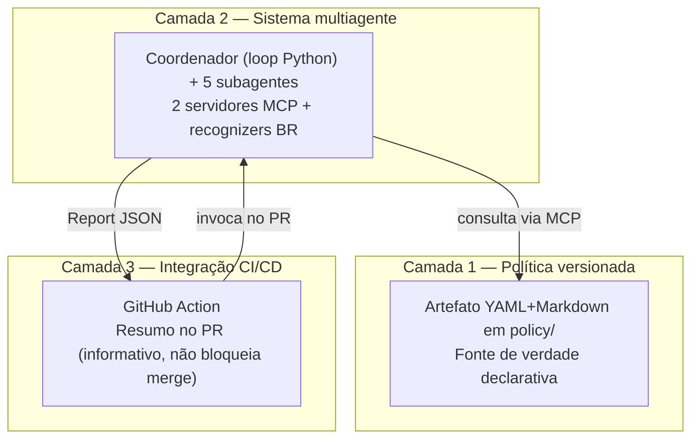
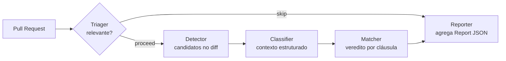

# lgpd-policy-review

**Code review automatizado de conformidade com a LGPD em pull requests, dirigido por uma Política de proteção de dados versionada.**

O sistema verifica, no momento do code review, se o tratamento de dados pessoais introduzido por um pull request está em conformidade com uma **Política** declarativa — um artefato YAML versionado em Git que codifica obrigações da LGPD (Lei nº 13.709/2018) em cláusulas verificáveis por software. A Política é a fonte de verdade do que constitui conformidade; o sistema multiagente que a consome é apenas uma das máquinas possíveis para interpretá-la. Construído sobre **Claude Agent SDK**, **Claude Code** e **Model Context Protocol (MCP)**.

> Protótipo acadêmico — Trabalho de Conclusão de Curso do Bacharelado em Engenharia de Software da **UTFPR** (Câmpus Dois Vizinhos, 2026). É um artefato de pesquisa, **não uma ferramenta de produção**. Prioriza correção, auditabilidade e reprodutibilidade; otimização de desempenho está fora de escopo. Título da monografia: *Da lei ao pull request: um sistema multiagente dirigido por uma Política de proteção de dados versionada.*

---

## Sumário

- [Status do projeto](#status-do-projeto)
- [A ideia central](#a-ideia-central)
- [Os quatro vereditos e a honestidade epistêmica](#os-quatro-vereditos-e-a-honestidade-epistêmica)
- [Arquitetura em três camadas](#arquitetura-em-três-camadas)
- [A Política versionada](#a-política-versionada)
- [Componentes](#componentes)
- [Stack](#stack)
- [Setup](#setup)
- [Como executar](#como-executar)
- [Integração CI/CD](#integração-cicd)
- [Avaliação empírica](#avaliação-empírica)
- [Estrutura do repositório](#estrutura-do-repositório)
- [Documentação](#documentação)
- [Fronteiras e limitações declaradas](#fronteiras-e-limitações-declaradas)
- [Contexto acadêmico](#contexto-acadêmico)
- [Licença](#licença)

---

## Status do projeto

**MVP completo.** As três camadas estão construídas e exercitadas de ponta a ponta sobre pull requests sintéticos.

| Marco | Escopo | Estado |
|---|---|---|
| **A** | Servidor MCP `policy-reader` | Fechado (gate via MCP Inspector CLI) |
| **B** | Servidor MCP `semgrep-runner` | Fechado (gate sobre transporte stdio real) |
| **C** | Pipeline multiagente (coordenador + 5 subagentes) | Fechado — gate Camada-3-MVP PASS local **e** em CI |
| **D** | Job de produção por pull request + bloqueio condicional de merge | **Diferido** (job inerte, `if: false`) |

Qualidade estática (suíte não-`live`): **307 testes passando** (309 coletados, 2 `live` deselecionados por padrão), `ruff check` limpo e `mypy --strict` limpo. O gate determinístico de avaliação registra **13/13** casos engine-runnable casando com o veredito esperado.

O Marco D — execução automática em cada pull request e o bloqueio condicional de merge — permanece como trabalho futuro. Quando uma ação depende dessa infraestrutura diferida, este README diz isso explicitamente em vez de apresentá-la como operante.

## A ideia central

Ferramentas de detecção de PII em código (ex.: scanners de SSN, regras genéricas) acoplam o que é "conformidade" ao próprio código de varredura. Este trabalho inverte essa relação: a **Política é um artefato declarativo de primeira classe**, versionado e auditável **independentemente do mecanismo que a interpreta** — e independentemente da jurisdição que codifica.

Três consequências fecham a tese:

- **Política revisável por jurista.** O YAML+Markdown sob [`policy/`](policy/) pode ser revisado por um profissional do Direito sem conhecimento de agentes, validado em CI, ou consumido por qualquer cliente que implemente o protocolo MCP.
- **Multiagente como decomposição por responsabilidade única.** Cada subagente tem uma responsabilidade nominal sem "e", *tools* restritas e *system prompt* focado. A regra é a fronteira; a quantidade (cinco) é consequência.
- **Trocar a jurisdição é trocar dados, não código.** LGPD é a instância exemplar do MVP, não um invariante do sistema. Substituir o framework jurisdicional (LGPD → GDPR) é trocar a Política e os vocabulários — sem alterar subagentes, servidores MCP ou a integração CI/CD (ver [ADR-0005](docs/adr/0005-multi-client-policy-architecture.md)).

## Os quatro vereditos e a honestidade epistêmica

Três regras de domínio são imutáveis — violá-las invalida a contribuição acadêmica.

**1. Sem certeza fabricada.** Quando a análise estática de um PR não consegue decidir conformidade com confiança — porque a verificação exigiria observação em runtime, comportamento *upstream* ou contexto que o diff não expõe — o sistema retorna `indeterminate` com um `verification_scope` apontando a dimensão que um revisor humano precisa verificar manualmente. Ele nunca fabrica `compliant` ou `violation_candidate` para parecer conclusivo. Os quatro vereditos válidos:

| Veredito | Significado |
|---|---|
| `compliant` | O tratamento declarado satisfaz a cláusula avaliada. |
| `violation_candidate` | Há contradição declarada com um requisito da cláusula. |
| `indeterminate` | A decisão exige verificação fora do alcance da análise estática (carrega `verification_scope`). |
| `not_applicable` | A cláusula não se aplica a este ponto de tratamento. |

**2. Citação de IDs de cláusula estáveis.** Todo *finding* cita o `clause_id` opaco com prefixo `POL-` (ex.: `POL-007`) da cláusula em que se apoia. O mapeamento para o texto legal (lei, artigo, parágrafo, inciso, alínea) vive no campo `statutory_reference` da cláusula, não no ID. *Findings* sem `clause_id` são rejeitados pela validação.

**3. Conformidade declarativa, não efetiva.** O sistema verifica o que o código *declara* fazer com dados pessoais — não o que o sistema em produção *de fato* faz. Uma anotação `# anonimizado via SHA-256` é lida como declaração; se em produção a anonimização é contornada por uma *feature flag*, o sistema não vê e não tem como ver. Esse limite é deliberado, e por isso `indeterminate` é veredito de primeira classe.

## Arquitetura em três camadas



A separação carrega três compromissos: Política auditável independente do agente, multiagente por *single responsibility*, e CI/CD como interface fina e substituível. O fluxo de execução é uma **pipeline determinística** orquestrada por um coordenador — um *main loop* em Python (não um `AgentDefinition`) que invoca cada subagente como uma chamada sequencial e isolada do SDK:



Cada etapa consome o output estruturado da anterior. O único *gate* condicional é o Triager (skip vai direto ao Reporter, que é sempre o único locus emissor). A visão sistêmica completa está em [`docs/architecture-overview.md`](docs/architecture-overview.md); o modelo dinâmico *as-built* (do PR ao Report) em [`docs/execution-model.md`](docs/execution-model.md).

## A Política versionada

A Política é **dados, não código**. O servidor `policy-reader` a carrega no *startup* e a expõe a agentes. O layout (canonizado em [`policy/SCHEMA.md`](policy/SCHEMA.md)):

```
policy/
├── policy.yaml              # header global: as três axes de identidade + accepted_law_identifiers
├── SCHEMA.md                # schema canônico (camada estrutural universal — não lido em runtime)
├── clauses/                 # cláusulas em YAML (destilação operacional consumida pelo MCP)
│   └── POL-000.yaml
├── rationale/               # canônico jurídico em Markdown (consumido por humano; prevalece em drift)
│   └── POL-000.md
└── vocabularies/LGPD/       # vocabulários jurisdicionais como dados (per-cliente)
    ├── operation.yaml       # 22 operações de tratamento
    ├── lawful_basis.yaml    # 18 bases legais (Art. 7º + Art. 11)
    ├── control.yaml         # 2 controles no MVP: consent_required, anonymization_required
    └── out_of_scope.yaml    # 7 razões de exclusão explícita
```

**Três eixos de identidade**, declarados no header e identificando univocamente o estado da Política numa decisão (provenance temporal e jurisdicional, propagado em todo veredito):

| Eixo | Natureza | Valor no seed |
|---|---|---|
| `policy_schema_version` | semver da estrutura do schema | `0.1.0` |
| `policy_version` | semver do conteúdo das cláusulas | `0.1.0` |
| `legal_framework` | jurisdição (valor único, imutável na sessão) | `LGPD` |

**POL-000** é a cláusula `definitional` de referência: o equivalente operacional do Art. 5º da LGPD dentro da Política. Define **9 classes funcionais de dado pessoal** (identificação, documentos oficiais, contato, localização, autenticação, financeiros, saúde, biométricos, perfil comportamental), das quais saúde e biométricos carregam `special_category: true`. O MVP do produto **distribui apenas POL-000**; cláusulas substantivas são autoradas por cliente.

**`policy/` × `policies/`.** [`policy/`](policy/) é o *seed* ativo do produto (POL-000 apenas; é o fallback default do *loader*). [`policies/`](policies/) guarda Políticas completas de avaliação: [`policies/eval-lgpd/`](policies/eval-lgpd/) (com cláusulas substantivas ativas POL-005/006/007, usada pelo gate Camada-3) e [`policies/eval-gdpr/`](policies/eval-gdpr/) (instância gêmea sob GDPR). A escolha da raiz é feita por `POLICY_READER_ROOT`. O par LGPD/GDPR prova o **swap de framework**: o mesmo código de PR muda de veredito por diferença de **vocabulário de base legal**, não de código.

## Componentes

### Servidores MCP

**`policy-reader`** — expõe a Política carregada como recurso consultável. Implementado em FastMCP 3.x. Três *resources* (`policy://catalog`, `policy://schema-version`, `policy://vocabularies`) e três *tools* (`get_clause`, `find_clauses_by_law_article`, `check_applicability`). Aborta o *boot* se a `policy_schema_version` da Política cair fora do range de compatibilidade suportado. Spec: [`docs/specs/policy-reader/`](docs/specs/policy-reader/).

**`semgrep-runner`** — expõe execução *diff-aware* do Semgrep como a *tool* `scan_diff(base_ref, head_ref)`, aplicando server-side um conjunto curado de regras e retornando *matches* estruturados (arquivo, linha, regra, snippet). Inclui o **pack de recognizers brasileiros** — diferencial frente a ferramentas que só reconhecem identificadores anglófonos:

| Regra | Identificador | Severidade |
|---|---|---|
| `br-cpf` | CPF | warning |
| `br-cnpj` | CNPJ | warning |
| `br-cnh` | CNH | warning |
| `br-nis-pis` | NIS/PIS | warning |
| `br-titulo-eleitor` | Título de eleitor | warning |
| `br-cns-saude` | CNS (saúde) | **error** (dado sensível, Art. 11) |

As regras são YAML em [`mcp_servers/semgrep_runner/rules/`](mcp_servers/semgrep_runner/rules/) (dados, separadas do código em `src/mcp_servers/semgrep_runner/`). Spec: [`docs/specs/semgrep-runner/`](docs/specs/semgrep-runner/).

Ambos seguem o envelope de erro **Option B** (ADR-0002): erros de domínio são discriminados pela presença de um `errorCode` estável em inglês no `structuredContent`, com mensagem em português.

### Coordenador e os cinco subagentes

O coordenador orquestra a pipeline e **agrega** o Report final (os subagentes não acumulam estado entre si — o output de cada etapa é serializado em JSON no prompt da próxima). Cada subagente tem *tools* restritas por governança de dois eixos (capacidade × disponibilidade, [ADR-0012](docs/adr/0012-subagent-tool-governance.md)):

| Subagente | Responsabilidade | Tools |
|---|---|---|
| **Triager** | Decide se o PR é relevante para análise. | `Read`, `Glob` |
| **Detector** | Localiza pontos de tratamento candidatos no diff. | `Read`, `semgrep-runner` (`scan_diff`) |
| **Classifier** | Extrai contexto estruturado de cada candidato (operação, categorias, base legal, transformações declaradas). | `Read`, `Grep`, resource `policy://vocabularies` |
| **Matcher** | Avalia conformidade por cláusula — **único emissor de veredito**. | *tools* do `policy-reader` + `policy://catalog` |
| **Reporter** | Serializa o Report consolidado via a *tool* exclusiva `emit_report`. | `emit_report` |

Nenhum subagente escreve no filesystem do projeto sob análise — o sistema é apenas leitor. A exclusividade de `emit_report` garante que o output final tem origem rastreável: um único subagente a auditar se o Report estiver malformado. Detalhamento por subagente (contratos, *output schemas*, justificativas) em [`docs/specs/subagents/`](docs/specs/subagents/) e na §5 do [`architecture-overview.md`](docs/architecture-overview.md).

> Invariante de privacidade: os *output schemas* dos subagentes e o `inputSchema` de `emit_report` carregam apenas **tokens de vocabulário** (ex.: `cpf` como nome de categoria), nunca **valores** de dado pessoal — que vivem só no conteúdo das mensagens (ver [`.claude/rules/privacy-safety.md`](.claude/rules/privacy-safety.md)).

## Stack

| Camada | Tecnologia |
|---|---|
| Linguagem | Python 3.12.7 (pinada em `.python-version`) |
| Gerência de deps + Python + build | **uv** (`uv.lock` versionado, backend `uv_build`) — ver [ADR-0004](docs/adr/0004-uv-and-fastmcp-3x.md) |
| Runtime de agentes | claude-agent-sdk 0.2.87, Claude Code CLI (v2.1.123+), MCP |
| Framework MCP | FastMCP 3.2.4 |
| Validação de schema | Pydantic 2.13.4 |
| Análise estática + recognizers BR | Semgrep 1.163.0 (via `uv tool install`, [ADR-0010](docs/adr/0010-semgrep-installation-strategy.md)) |
| Lint/format · Type check · Testes | Ruff · mypy (strict) · pytest + pytest-asyncio |
| CI/CD | GitHub Actions |

Ambiente de referência: Windows 11 corporativo (PowerShell 5.1, sem admin, sem WSL). Comandos e caminhos são compatíveis com Windows-nativo.

## Setup

**Pré-requisitos.** [uv](https://docs.astral.sh/uv/) (gerencia também o Python 3.12.7), **Git ≥ 2.30** no PATH (exigido pelo `scan_diff` para `--baseline-commit` / `git diff --merge-base`), e, opcionalmente, Node 24 para o MCP Inspector CLI. Para execução *live* da pipeline, uma sessão autenticada do Claude Agent SDK (ou `ANTHROPIC_API_KEY`).

```powershell
# Na raiz do repositório.

# 1. Dependências do projeto + interpretador Python 3.12.7 (uv provisiona ambos)
uv sync

# 2. Semgrep CLI — user-scope, isolado, FORA do uv.lock (ADR-0010)
uv tool install semgrep==1.163.0

# 3. Verificação
semgrep --version   # esperado: 1.163.0
```

O Semgrep é deliberadamente externo ao `uv sync`: clones novos exigem o `uv tool install` separado. O `uv.lock` é a fonte determinística das versões — em divergência, sincronize com `uv sync`.

## Como executar

### Testes, lint e tipos

```powershell
uv run pytest                 # suíte padrão (testes 'live' excluídos)
uv run pytest -m live         # suíte live (precisa de sessão autenticada do SDK + semgrep no PATH)
uv run ruff check .           # lint
uv run mypy --strict src      # type check estrito
```

A marca `live` cobre os testes ponta-a-ponta que dirigem o SDK e os servidores MCP reais; ficam fora do *run* padrão (`addopts = -m 'not live'`).

### Servidores MCP (transporte stdio)

Registrados em [`.mcp.json`](.mcp.json); lançáveis isoladamente:

```powershell
uv run python -m mcp_servers.policy_reader.server
uv run python -m mcp_servers.semgrep_runner.server
```

Exercício reprodutível via MCP Inspector CLI (ver [`.claude/rules/mcp-testing.md`](.claude/rules/mcp-testing.md)):

```powershell
npx @modelcontextprotocol/inspector --cli `
  uv run python -m mcp_servers.policy_reader.server --method resources/list
```

### Avaliação determinística (sem modelo)

O *harness* de motor exercita o núcleo do sistema — a lógica dos quatro vereditos de `check_applicability` — em processo, sem LLM nem MCP wire:

```powershell
uv run python eval/harness/run_engine_cases.py            # tabela
uv run python eval/harness/run_engine_cases.py --json     # saída de máquina
```

### Pipeline completa (modelo + MCP ao vivo)

A entrada pública é a corrotina `run_pipeline` em [`src/coordinator/run.py`](src/coordinator/run.py):

```python
from pathlib import Path
from coordinator.run import run_pipeline
from coordinator.models import CoordinatorReport, CoordinatorError
from subagents.triager.models import TriagerInput

scope = TriagerInput(pr_number=1, base_ref="<sha>", head_ref="<sha>", repo_url="<url>")
result = await run_pipeline(scope)          # CoordinatorReport | CoordinatorError
```

O gate de milestone Camada-3-MVP exercita essa pipeline de ponta a ponta sobre fixtures, comparando o Report ao vivo contra um baseline por campo:

```powershell
uv run python -m eval.harness.camada3_gate --case COMP-001   # ou VIOL-001 | SKIP-001 | all
```

O adaptador de borda da CI ([`scripts/ci/run_review.py`](scripts/ci/run_review.py)) lê `BASE_REF`/`HEAD_REF`/`PR_NUMBER`/`REPO_URL` do ambiente, chama `run_pipeline` e escreve o resumo em stdout (exit 0 = Report; 1 = halt terminal; 2 = invocação inválida). Hoje ele é exercido apenas pelos testes; seu único chamador em runtime seria o job de produção, diferido ao Marco D.

## Integração CI/CD

[`.github/workflows/lgpd-review.yml`](.github/workflows/lgpd-review.yml) tem dois jobs:

- **`validate`** — roda em `workflow_dispatch`, em matriz sobre `COMP-001`/`VIOL-001`/`SKIP-001`, executando o gate Camada-3 e escrevendo o resultado no *Step Summary*. É a superfície de CI que efetivamente roda.
- **`production-pr`** — **inerte** (`if: false`), declarado mas não executado: é o contrato do *entrypoint* de produção, **diferido ao Marco D**.

No MVP, o posicionamento é **informativo, não bloqueante** ([RNF-002](docs/REQUIREMENTS.md)): o sistema reporta um resumo agregado por veredito e **não bloqueia merge** — cabe ao revisor humano julgar. Postagem ativa no PR (comentários por linha) e bloqueio condicional de merge sob critério de taxa de falso-positivo validada são trabalho futuro do Marco D, não implementados hoje.

## Avaliação empírica

A avaliação vive sob [`eval/`](eval/), em três níveis de fidelidade:

- **Motor determinístico** ([`eval/harness/run_engine_cases.py`](eval/harness/run_engine_cases.py)) — sem modelo; valida os quatro vereditos e monta Reports consolidados reutilizando as derivações do próprio coordenador. Evidência em [`eval/harness/gate_run.json`](eval/harness/gate_run.json): **13/13** casos engine-runnable.
- **Gate Camada-3-MVP ao vivo** ([`eval/harness/camada3_gate.py`](eval/harness/camada3_gate.py)) — constrói um repositório git efêmero de dois commits, roda a pipeline real e compara o Report por campo (STRICT em `run_outcome`, contagens, provenance e o multiset `(verdict, rule_id)`; advisory em `data_categories`).
- **Experimentos** ([`eval/experiments/`](eval/experiments/)) — medições *live* opt-in (discriminante de exposição de categorias; caracterização e2e da pipeline) que registram distribuições brutas e **não tiram conclusão** — o humano lê.

Os casos de teste são **pull requests sintéticos** em [`eval/prs/`](eval/prs/) (ex.: `VIOL-001` = coleta de identificação sem base legal → `violation_candidate`; `SWAP-001` = flip jurisdicional LGPD/GDPR). Cada um traz um identificador BR sintético que dispara o Detector e um `.expected-report.json` de baseline. Todos os valores de PII são sintéticos (ver [`.claude/rules/privacy-safety.md`](.claude/rules/privacy-safety.md)). O catálogo legível por máquina está em [`eval/cases.yaml`](eval/cases.yaml).

> O benchmark de ~200 snippets mencionado na proposta é um **plano**; o estado realizado é o conjunto de PRs sintéticos + catálogo + *harness* acima, suficiente para a validação qualitativa em escala de TCC.

## Estrutura do repositório

```
lgpd-policy-review/
├── policy/                  # Camada 1 — Política ATIVA (seed do produto, POL-000 apenas)
├── policies/                # Políticas de avaliação multi-cliente (eval-lgpd, eval-gdpr) — ADR-0005
├── src/
│   ├── coordinator/         # Camada 2 — main loop Python (run.py = run_pipeline), driver, config, errors, models, prompts
│   ├── subagents/           # Os cinco subagentes: triager, detector, classifier, matcher, reporter
│   └── mcp_servers/          # CÓDIGO dos servidores MCP: policy_reader/, semgrep_runner/
├── mcp_servers/             # DADOS do semgrep-runner: o pack de regras YAML (6 recognizers BR)
├── eval/                    # Avaliação: cases.yaml, harness/, experiments/, prs/, proposed/
├── scripts/                 # ci/ (adaptadores de borda), gate_milestone_b_exercise.py, smoke_tests/
├── tests/                   # pytest: coordinator/, subagents/, mcp_servers/, harness/, ci/
├── docs/                    # Documentação (ver mapa abaixo)
├── .github/                 # workflows/lgpd-review.yml + PULL_REQUEST_TEMPLATE.md
├── .claude/                 # rules/*.md (regras de projeto carregadas automaticamente)
├── CLAUDE.md                # Memória de projeto (regras imutáveis, stack canônica)
├── .mcp.json                # Registro dos servidores policy-reader e semgrep-runner
└── pyproject.toml · uv.lock · .python-version
```

> Nota: o código do `semgrep-runner` mora em `src/mcp_servers/semgrep_runner/`, mas o **pack de regras** (dados) mora em `mcp_servers/semgrep_runner/rules/` — dois diretórios distintos por design ([ADR-0010](docs/adr/0010-semgrep-installation-strategy.md)).

## Documentação

- **Arquitetura** — [`docs/architecture-overview.md`](docs/architecture-overview.md) (visão estrutural) · [`docs/execution-model.md`](docs/execution-model.md) (modelo dinâmico *as-built*).
- **Requisitos e design** — [`docs/REQUIREMENTS.md`](docs/REQUIREMENTS.md) (RF/RNF) · [`docs/DESIGN.md`](docs/DESIGN.md) · [`docs/tasks.md`](docs/tasks.md).
- **Specs de componente** — [`docs/specs/policy-reader/`](docs/specs/policy-reader/) · [`docs/specs/semgrep-runner/`](docs/specs/semgrep-runner/) · [`docs/specs/subagents/`](docs/specs/subagents/) (cada uma em par *canonical* + *compact*).
- **Decisões arquiteturais** — [`docs/adr/`](docs/adr/), 16 ADRs (0001–0016) cobrindo bootstrap, convenções MCP, arquitetura dual-spec, adoção de uv/FastMCP, suporte multi-cliente de Política, convenções de linguagem, escopo do MVP, decomposição de tarefas, fronteiras de domínio, instalação do Semgrep, stdio no Windows, governança de *tools* de subagente, taxonomia de erro do coordenador, ciclo de vida de conexão MCP, vocabulário de controle e o guard de emissão única do Reporter.
- **Processo e avaliação** — [`docs/process/`](docs/process/) (gates de milestone, relatório de QA, *learning-log*, relatórios do TCC) · [`docs/eval/`](docs/eval/) (análises da avaliação empírica).

Idiomas: código, comentários, ADRs e specs em **inglês**; conteúdo da Política e saídas ao usuário (reports, comentários de PR) em **português brasileiro**, por fidelidade legal à LGPD ([ADR-0006](docs/adr/0006-language-conventions.md)).

## Fronteiras e limitações declaradas

Declarar o que o sistema **não** é protege a defesa do TCC de questionamentos que o trabalho não se propôs a responder:

- **Conformidade declarativa, não efetiva** — verifica o que o código declara, não o comportamento em produção (ver acima).
- **PR-scoped, não system-wide** — analisa o diff de um PR; não audita o repositório inteiro nem cruza informação entre PRs.
- **Escopo do MVP** — a avaliação de conformidade é restrita à operação `collection` ([ADR-0007](docs/adr/0007-mvp-collection-only-scope.md)); as demais operações retornam `not_applicable` com razão de escopo. A Política v0.1.0 cobre apenas os controles `consent_required` e `anonymization_required`.
- **Limitação conhecida (sub-modelagem de sensibilidade)** — o motor avalia `consent_required` por igualdade contra o token `consent` sem consumir a categoria de base legal; para dado sensível (saúde, Art. 11) isso inverte o resultado juridicamente esperado. Diagnosticada com causa-raiz, com correção desenhada em [ADR-0015](docs/adr/0015-control-vocabulary-lawful-basis-required.md) (proposta, não ratificada) e documentada em [`docs/eval/pol-007-inversao-sensibilidade.md`](docs/eval/pol-007-inversao-sensibilidade.md).
- **O que a tese não pretende provar** — taxa de falso-positivo aceitável para produção; cobertura jurídica integral da LGPD; superioridade do multiagente sobre single-agent. O TCC demonstra a **viabilidade da abordagem** em escala de validação sintética.

## Contexto acadêmico

Trabalho de Conclusão de Curso do **Bacharelado em Engenharia de Software** da **Universidade Tecnológica Federal do Paraná (UTFPR)**, Câmpus Dois Vizinhos, 2026.

- **Autor:** João Guilherme de Mello Paiva Pereira
- **Orientadora:** Profa. Alinne Cristinne Corrêa Souza
- **Metodologia:** Spec-Driven Development — especificações sob [`docs/specs/`](docs/specs/) e decisões sob [`docs/adr/`](docs/adr/) são artefatos primários; o código é saída derivada ([ADR-0008](docs/adr/0008-task-decomposition-and-verification.md)).

> Projeto em fase de desenvolvimento acadêmico. Não usar em produção sem revisão por desenvolvedor sênior.

## Licença

Código distribuído sob a [Licença MIT](LICENSE). O conteúdo da Política sob [`policy/`](policy/) é trabalho derivado de literatura técnica e legislação pública brasileira; a revisão de licenciamento específico para o documento de política está prevista para a versão 1.0.
