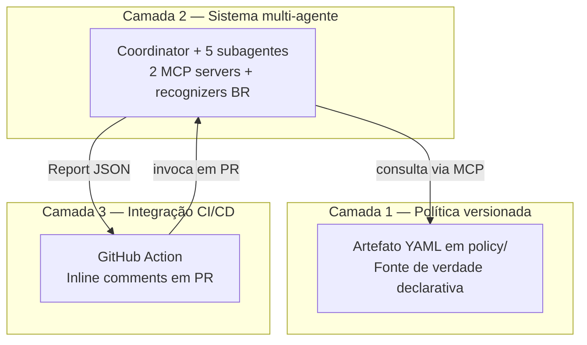
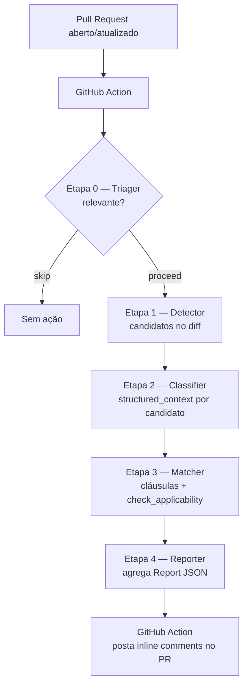

# Architecture Overview

## Como ler este documento

Este documento descreve a arquitetura do sistema em sete seções. As seções 1 a 3 dão a visão geral (frase de negócio, separação em camadas, fluxo de execução). A seção 4 inventaria os componentes do sistema. A seção 5 detalha cada subagente como contrato (responsabilidade, tools, output). As seções 6 e 7 cobrem decisões operacionais e fronteiras epistêmicas. Specs de implementação e ADRs de decisão são referenciados quando relevantes, mas vivem em arquivos próprios sob `docs/specs/` e `docs/adr/`.

O glossário a seguir define os termos centrais que aparecem ao longo do documento.

## Glossário

**MCP (Model Context Protocol).** Protocolo aberto que define como agentes de IA consomem dados estruturados (chamados *resources*) e invocam operações externas (chamadas *tools*). Um *MCP server* é um processo independente que expõe esses dois tipos de capacidade; um agente atua como cliente MCP. Neste sistema, dois MCP servers são implementados: `policy-reader` e `semgrep-runner`.

**Política versionada.** Termo técnico deste trabalho. Refere-se ao artefato declarativo em YAML+Markdown sob `policy/` que codifica obrigações do framework jurisdicional declarado no header (e.g., LGPD) em cláusulas verificáveis, com versionamento explícito do schema, do conteúdo e do framework. Personalizada por cliente. Não confundir com "política de privacidade" no sentido jurídico-empresarial usual — aqui, *Política* (com inicial maiúscula) é sempre esse arquivo estruturado.

**Subagente.** Agente especializado, com responsabilidade delimitada e tools restritas, invocado por um *coordinator* (agente de orquestração). A decomposição multi-agente deste sistema usa cinco subagentes (Triager, Detector, Classifier, Matcher, Reporter) sob um coordinator.

**Tools (Read, Glob, Grep, Write, Edit, Bash).** Operações nomeadas que um agente pode executar via runtime. *Read* lê arquivo; *Glob* lista arquivos por pattern; *Grep* busca por regex; *Write/Edit* modificam arquivo; *Bash* executa comando shell. Ao longo deste documento, "tool" sempre se refere a essa unidade de capacidade. Tools customizadas (como `emit_report` neste sistema) são definidas pelo próprio projeto.

**Hook.** Mecanismo de enforcement determinístico do runtime, executado em momentos específicos do ciclo de vida de uma tool. *PreToolUse* roda antes de uma tool ser invocada; *PostToolUse* roda depois. Usado para validações que não podem ter falha probabilística — diferente de *prompt-based guidance*, que orienta o agente via instrução em linguagem natural mas não garante cumprimento.

## 1. Visão de negócio

Sistema de code review automatizado em pull requests que verifica conformidade do tratamento de dados pessoais com uma Política versionada que codifica o framework jurisdicional declarado (LGPD no MVP).

## 2. Arquitetura em três camadas

**Camada 1 — Política versionada.** Artefato declarativo em YAML+Markdown sob `policy/`, **personalizada por cliente**. Fonte de verdade do que constitui conformidade. Versionada em três eixos independentes: `policy_schema_version` (esquema estrutural), `policy_version` (conteúdo das cláusulas) e `legal_framework` (framework jurisdicional, e.g., LGPD no MVP). Vocabulários jurisdicionais vivem como dados em `policy/vocabularies/<framework>/`, não hardcoded no sistema. Independente da máquina que a consome — pode ser revisada por jurista sem conhecimento de agentes, validada em CI, ou consumida por qualquer agente que implemente o protocolo MCP. Trocar o framework do cliente (LGPD → GDPR) é trocar a Política, não o código do sistema.

**Camada 2 — Sistema multi-agente.** Um coordinator orquestra cinco subagentes especializados (Triager, Detector, Classifier, Matcher, Reporter) e dois MCP servers (`policy-reader` para acesso à Política, `semgrep-runner` para detecção sintática). Recognizers brasileiros — CPF, CNPJ, CNH, NIS/PIS, título de eleitor, CNS-saúde — compõem o módulo de detecção. A camada inteira é detalhada na seção 5.

**Camada 3 — Integração CI/CD.** GitHub Action que dispara o sistema multi-agente em pull requests, recebe o Report JSON e posta findings como inline comments no PR. Informativa no MVP — não bloqueia merge. Bloqueio condicional fica como evolução pós-validação empírica de taxa de falso-positivo.

A separação em camadas não é estética. Ela carrega três compromissos arquiteturais já fechados em decisões anteriores:

- **Política como artefato auditável independente do agente que a interpreta.** O YAML pode ser revisado por jurista sem conhecimento de agentes. O agente pode ser trocado sem reescrever a Política.
- **Multi-agente como decomposição por single responsibility, não otimização prematura.** Cada subagente tem responsabilidade nominal sem "e", tools restritas, system prompt focado. A regra é a fronteira; a quantidade (cinco) é consequência.
- **CI/CD como interface fina e substituível.** A lógica de conformidade não vive em script de Action — vive no sistema multi-agente. Trocar GitHub Action por GitLab CI ou Jenkins é trabalho de adaptador, não reescrita.

Esses três compromissos são o teste prático de se a arquitetura sobrevive à substituição de qualquer camada sem reescrita das outras.

## 3. Fluxo de execução

O fluxo é orquestrado por um coordinator que invoca cada subagente em sequência. As etapas 1 a 4 formam uma pipeline determinística: cada etapa consome o output estruturado da anterior. O único gate condicional é a etapa 0.

**Etapa 0 — Triager.** Recebe o diff do PR e decide se a análise prossegue. Decisão semi-semântica baseada em paths alterados e keywords no código. Output: `proceed` (com sumário do que torna o PR relevante) ou `skip` (com motivo).

**Etapa 1 — Detector.** Invoca o MCP server `semgrep-runner` para identificar pontos de tratamento candidatos no diff (chamadas que sugerem coleta, transformação, transferência ou armazenamento de dados pessoais). Recognizers brasileiros — CPF, CNPJ, CNH, NIS/PIS, título de eleitor, CNS-saúde — entram aqui como complemento à detecção sintática genérica. Output: lista de candidatos com localização (arquivo, linha, snippet).

**Etapa 2 — Classifier.** Para cada candidato, extrai `structured_context` com quatro campos: `operation_type` (coleta, uso, transferência, etc.), `data_categories` (CPF, e-mail, dado sensível, etc.), `declared_legal_basis` (consentimento, execução de contrato, etc., quando declarada), `declared_transformations` (anonimização, hash, criptografia, quando declaradas). Output: candidato enriquecido com contexto estruturado.

**Etapa 3 — Matcher.** Para cada candidato classificado, consulta o MCP server `policy-reader` via `find_clauses_by_law_article` para descobrir cláusulas aplicáveis, depois invoca `check_applicability` por cláusula. Cada invocação retorna um dos quatro vereditos: `compliant`, `violation_candidate`, `indeterminate` (com `verification_scope` indicando a dimensão a verificar manualmente), `not_applicable`. Output: lista de findings por candidato.

**Etapa 4 — Reporter.** Agrega os findings em um Report JSON consolidado por execução, com `report_id`, `policy_schema_version`, `policy_version`, `scope`, `summary` por veredito, e `findings` detalhados. Emite via tool customizada `emit_report`. Output: Report JSON entregue ao GitHub Action, que o transforma em inline comments.

A pipeline é fixa, não adaptativa. A escolha é deliberada: o problema é cobertura sistemática de pontos de tratamento em um diff (revisão multi-aspecto previsível), não investigação aberta. Cada etapa tem entrada e saída pré-definidas, o que permite testar cada subagente isoladamente, observar custo por etapa, e substituir um subagente sem reescrever os outros.

## 4. Componentes mapeados

Esta seção enumera os componentes do sistema. Detalhamento de cada um vive em spec/ADR próprio (referenciados quando existem) ou em seção posterior deste mesmo documento.

### 4.1 Artefato declarativo

**Política versionada.** Artefato declarativo em YAML+Markdown sob `policy/`, **personalizada por cliente**. Cada cliente do sistema mantém sua própria Política sob o framework jurisdicional aplicável; LGPD é instância exemplar do MVP, não framework default codificado.

Identidade da Política tem **três eixos independentes**, todos declarados no header global `policy.yaml`:

- `policy_schema_version` — esquema estrutural do artefato (universal, versionado no projeto).
- `policy_version` — conteúdo das cláusulas (per-cliente, evolui conforme entendimento jurídico do cliente).
- `legal_framework` — framework jurisdicional sob o qual a Política opera (valor único, imutável durante sessão do server). Ver ADR-0005.

A Política é composta por quatro peças sob `policy/`:

- `policy.yaml` — header global com os três eixos de identidade e `accepted_law_identifiers` (lista de leis citáveis dentro da jurisdição declarada).
- `clauses/` — cláusulas em YAML. Cada cláusula tem `clause_id` opaco com prefixo `POL-`, `article_source` como lista hierárquica (lei, artigo, parágrafo, inciso, alínea), `requirements`, `exceptions`, e ciclo de vida com `status: active|deprecated` mais `successors` para tombstone (sucessão intra-Política, não cross-framework).
- `rationale/` — canônico jurídico em Markdown, consumido por humano. Prevalece em drift contra YAML (ver `policy/SCHEMA.md` §8).
- `SCHEMA.md` — separa explicitamente **camada estrutural** (universal, vive no projeto) de **camada de vocabulários jurisdicionais** (per-cliente, vive em `policy/vocabularies/<framework>/`). Vocabulários jurisdicionais — `operation`, `lawful_basis`, `control`, `out_of_scope` — não são hardcoded em código; são lidos como dados em startup do `policy-reader`.

Detalhes contratuais no spec do `policy-reader` (`docs/specs/policy-reader/canonical.md` + `compact.md`). Decisões arquiteturais em ADR-0002 (MCP conventions) e ADR-0005 (multi-cliente).

### 4.2 MCP servers

**`policy-reader`.** Servidor MCP que expõe a Política do cliente carregada em startup como recurso consultável por agentes. Implementação em FastMCP 3.x (decidido em ADR-0004). Expõe **três resources** (`policy://catalog`, `policy://schema-version`, `policy://vocabularies`) e três tools (`get_clause`, `find_clauses_by_law_article`, `check_applicability`). O resource `policy://vocabularies` é read-only e idempotente, expondo os quatro vocabulários jurisdicionais (`operation`, `lawful_basis`, `control`, `out_of_scope`) carregados de `policy/vocabularies/<framework>/*.yaml` da Política. Contratos de erro em três categorias (validation/business/system) com `isError` flag, `errorCode` estável em inglês e `message` em português. Uma instância serve uma Política sob um framework, imutáveis durante a sessão — multi-framework simultâneo exige instâncias paralelas (ver ADR-0005).

**`semgrep-runner`.** Servidor MCP que expõe execução de Semgrep diff-aware como tool para o subagente Detector. Recebe os refs `base_ref` e `head_ref` do PR e aplica server-side o conjunto curado de regras de detecção, retornando matches estruturados (arquivo, linha, regra, snippet). No MVP, o rule set é bundled no projeto, com recognizers brasileiros como caso-piloto; rule set per-cliente é deferimento explícito até primeiro cliente fora do escopo LGPD-brasileiro materializar (ver §7.1 do canonical do `semgrep-runner`). Spec em `docs/specs/semgrep-runner/canonical.md`.

### 4.3 Sistema multi-agente

**Coordinator.** Agente de orquestração. Invoca os cinco subagentes em sequência conforme o fluxo da seção 3, gerencia state entre etapas, decide skip vs proceed após Triager, agrega o Report final via Reporter. Não detecta, classifica nem julga conformidade — só orquestra.

**Cinco subagentes especialistas.** Triager, Detector, Classifier, Matcher, Reporter. Cada um com responsabilidade nominal sem "e" e tools restritas. Detalhamento individual na seção 5.

**Tool customizada `emit_report`.** Tool exposta apenas ao subagente Reporter. Recebe o Report JSON estruturado e o entrega ao runtime do GitHub Action. Restrição de uso por subagente é o que garante que o output final tem origem rastreável e formato validado — qualquer outro subagente que tentasse emitir um Report seria bloqueado no nível de tool authorization.

**Hooks (ponto de extensão previsto).** Ainda sem hooks definidos no MVP. O design adotado deliberadamente decide que a etapa 0 (triagem de relevância) mora como subagente Triager, não como hook PreToolUse, porque envolve julgamento semi-semântico. Hooks ficam reservados para enforcement puramente determinístico (ex: validar formato JSON do Report antes de `emit_report` retornar, garantir que Detector só chame `semgrep-runner` e não outros MCPs). Decisões concretas sobre hooks ficam para o spec do coordinator ou ADR específico, quando emergir necessidade de enforcement determinístico que prompt-based guidance não cobre.

### 4.4 Detecção sintática

**Recognizers brasileiros.** Regras Semgrep ou módulos equivalentes para identificar identificadores brasileiros em código: CPF, CNPJ, CNH, NIS/PIS, título de eleitor, CNS-saúde. Mantidos como diferencial competitivo do MVP em relação a ferramentas existentes que tratam apenas identificadores de jurisdições anglófonas (SSN, ITIN, NHS Number). Operam dentro do `semgrep-runner`, invocados pelo Detector.

### 4.5 Validação empírica

**Benchmark sintético.** Conjunto de aproximadamente 200 snippets de código construídos para validar o sistema em escala de TCC. Cada snippet vem rotulado com veredito esperado (`compliant`, `violation_candidate`, `indeterminate`, `not_applicable`) por cláusula da Política aplicável. Estrutura, distribuição e protocolo de avaliação ainda não decididos — fica para ADR específico antes da fase de implementação dos subagentes.

### 4.6 Integração CI/CD

**GitHub Action.** Workflow YAML sob `.github/workflows/`. Disparado em eventos de pull request (`opened`, `synchronize`). Invoca o coordinator multi-agente passando o diff do PR e metadados (número do PR, branch, autor). Recebe o Report JSON, transforma findings em inline review comments via API do GitHub. No MVP, não bloqueia merge — postar comments é o único side effect.

## 5. Subagentes detalhados

Cada subagente é definido por três contratos: responsabilidade nominal sem "e" (uma frase), tools permitidas (lista explícita), output esperado (estrutura). O conjunto desses contratos é o que faz a arquitetura ser auditável e substituível em vez de monolítica.

### 5.1 Coordinator

**Responsabilidade.** Orquestra a sequência de subagentes conforme o fluxo da seção 3.

**Tools permitidas.** Despacho de subagentes (mecanismo de orquestração do runtime), gestão de state entre etapas. Sem acesso direto a Read/Write/Edit/Bash/Grep/Glob no filesystem do PR. Sem acesso direto aos MCP servers `policy-reader` e `semgrep-runner`.

**Input.** Diff do PR, metadados (número do PR, branch, autor), referência da Política a usar (`policy_version`).

**Output.** Report JSON final, agregado pelo Reporter na etapa 4.

**Justificativa da restrição de tools.** O coordinator não detecta, classifica nem avalia — só decide qual subagente chamar com qual contexto. Se ele tivesse Bash ou Read direto, viraria atalho fácil para "deixa o coordinator fazer essa parte rapidinho", e a fronteira entre orquestração e execução desapareceria. Tool restriction aqui não é segurança contra agente malicioso — é proteção contra a tentação de furar a arquitetura sob pressão.

### 5.2 Triager

**Responsabilidade.** Decide se um PR é relevante para análise de conformidade contra a Política carregada.

**Tools permitidas.** Read (sobre arquivos do diff), Glob (para inspecionar paths alterados). Sem MCP servers, sem Bash, sem Write/Edit.

**Input.** Diff do PR, lista de paths alterados.

**Output.** Decisão estruturada: `{decision: "proceed", relevance_summary: string}` ou `{decision: "skip", skip_reason: string}`.

**Justificativa do escopo.** Triager não classifica nem julga conformidade — só responde "vale a pena prosseguir?". Decisão semi-semântica baseada em paths (ex: mudanças só em `docs/` ou `tests/` provavelmente são skip) e keywords no diff (ex: ausência total de termos relacionados a tratamento de dados sugere skip). Mora como subagente, não como hook PreToolUse, porque envolve julgamento — hook fica reservado para enforcement determinístico.

### 5.3 Detector

**Responsabilidade.** Identifica pontos de tratamento candidatos em um diff.

**Tools permitidas.** MCP server `semgrep-runner` (tool `scan_diff` de scan diff-aware), Read (sobre arquivos do diff para inspeção complementar). Sem `policy-reader`, sem Write/Edit/Bash.

**Input.** Refs `base_ref` e `head_ref` do PR.

**Output.** Lista de candidatos: `[{file, line, rule_id, snippet, surrounding_context}]`.

**Justificativa do escopo.** Detector não decide se há violação — só localiza onde há possibilidade. A fronteira "detecta possibilidade vs avalia conformidade" é o que separa Detector de Matcher. Sem acesso ao `policy-reader`, o Detector é fisicamente impedido de "adivinhar" cláusulas aplicáveis e contaminar o output com pré-julgamento.

### 5.4 Classifier

**Responsabilidade.** Extrai contexto estruturado de cada ponto de tratamento candidato.

**Tools permitidas.** Read (sobre arquivos do projeto, para inspecionar imports, definições de função, contexto além das linhas do snippet), Grep (para buscar declarações de base legal, transformações ou anonimização em comentários e docstrings próximas), e leitura do resource `policy://vocabularies` do `policy-reader` (read-only, sem acesso às tools do `policy-reader`). Sem `semgrep-runner`, sem Write/Edit/Bash.

**Input.** Lista de candidatos do Detector.

**Output.** Mesma lista enriquecida com `structured_context: {operation_type, data_categories, declared_legal_basis, declared_transformations}` por candidato. Valores em `operation_type`, `data_categories` e `declared_legal_basis` são restringidos aos vocabulários jurisdicionais expostos por `policy://vocabularies`.

**Justificativa do escopo.** Classifier opera sobre o código local e contra os vocabulários jurisdicionais publicados pela Política — não consulta cláusulas nem julga conformidade. A separação é deliberada: o `structured_context` é descrição factual do que o código faz e do que ele declara fazer, alinhada ao vocabulário do framework declarado, mas independente do que a Política exige cláusula a cláusula. Confundir extração com avaliação é o anti-padrão clássico de classificador acoplado a regras — o que torna impossível trocar a Política sem reescrever o Classifier.

A inclusão do resource `policy://vocabularies` (sem acesso às tools do `policy-reader`) materializa o princípio **Resource vs Tool**: vocabulários jurisdicionais são catálogo idempotente compartilhável por múltiplos consumidores; cláusulas são consultas direcionadas com semântica de ação, restritas ao Matcher. Classifier ganha visibilidade ao vocabulário sem ganhar capacidade de inferir veredito — fronteira "Classifier descreve, Matcher julga" preservada.

### 5.5 Matcher

**Responsabilidade.** Avalia conformidade de cada candidato contra cláusulas aplicáveis da Política.

**Tools permitidas.** MCP server `policy-reader` — tools (`find_clauses_by_law_article`, `get_clause`, `check_applicability`) e resource `policy://vocabularies` (compartilhado com Classifier). Sem `semgrep-runner`, sem Read/Write/Edit/Bash/Grep/Glob no filesystem.

**Input.** Lista de candidatos classificados (com `structured_context` completo).

**Output.** Lista de findings: `[{candidate_ref, clause_id, verdict, verification_scope?, requires_human_review?, evidence}]` onde `verdict ∈ {compliant, violation_candidate, indeterminate, not_applicable}`. Cada veredito carrega trinque de provenance `(policy_schema_version, policy_version, legal_framework)` retornado pelas tools do `policy-reader`.

**Justificativa do escopo.** Matcher é o único subagente autorizado a invocar tools do `policy-reader` e o único autorizado a emitir vereditos. Restrição de tools materializa a regra: ninguém mais pode "espiar" cláusulas para inferir veredito atalhando o protocolo. Sem acesso ao filesystem, o Matcher é forçado a confiar no `structured_context` que recebe — qualquer informação do código que ele precise vem do Classifier, não de leitura própria. Isso amarra a fronteira contratual entre as etapas 2 e 3.

Matcher é explicitamente **framework-aware**: consome vocabulários jurisdicionais via `policy://vocabularies` no startup e propaga `legal_framework` no trinque de provenance de cada veredito. Reasoning de aplicabilidade não codifica regras específicas a framework — regras vivem na Política como combinações `applies_to × control × exceptions`. Trocar o framework do cliente (e.g., LGPD → GDPR) é trocar a Política, não reescrever o Matcher.

### 5.6 Reporter

**Responsabilidade.** Agrega vereditos em um Report JSON consolidado.

**Tools permitidas.** Tool customizada `emit_report` (exclusiva). Sem MCP servers, sem Read/Write/Edit/Bash/Grep/Glob.

**Input.** Lista completa de findings do Matcher, mais metadados de execução (versão da Política consultada, escopo, identificadores do PR).

**Output.** Report JSON final entregue via `emit_report`, com a estrutura definida no spec do `policy-reader`: `{report_id, policy_schema_version, policy_version, legal_framework, scope, summary, findings}`. O campo `legal_framework` é top-level e não-opcional — em audit trails multi-jurisdição, sem ele o auditor não saberia sob qual framework a decisão foi tomada. Trinque de provenance `(policy_schema_version, policy_version, legal_framework)` é temporal e jurisdicional.

**Justificativa do escopo.** Reporter não detecta, não classifica, não julga — só formata. Dar a ele acesso a qualquer outra tool seria convidar refazimento de trabalho upstream. A exclusividade de `emit_report` (Reporter é o único subagente autorizado a invocá-la) garante que o output do sistema tem origem rastreável: se algo emitiu um Report, foi o Reporter; se o Report está malformado, há um único subagente para auditar.

### 5.7 Matriz tools × subagentes

| Tool / Recurso                                  | Coord | Triager | Detector | Classifier | Matcher | Reporter |
| ----------------------------------------------- | :---: | :-----: | :------: | :--------: | :-----: | :------: |
| Read                                            |       |    ✓    |    ✓     |     ✓      |         |          |
| Glob                                            |       |    ✓    |          |            |         |          |
| Grep                                            |       |         |          |     ✓      |         |          |
| Write / Edit / Bash                             |       |         |          |            |         |          |
| `semgrep-runner` MCP                            |       |         |    ✓     |            |         |          |
| `policy-reader` — tools                         |       |         |          |            |    ✓    |          |
| `policy-reader` — resource `policy://vocabularies` |    |         |          |     ✓      |    ✓    |          |
| `emit_report` (custom)                          |       |         |          |            |         |    ✓     |
| Despacho de subagentes                          |   ✓   |         |          |            |         |          |

A linha "Write / Edit / Bash" inteira em branco é deliberada: nenhum subagente do MVP escreve no filesystem do projeto sob análise — o sistema é apenas leitor. Qualquer side effect futuro (ex: subagente fix-proposer abrindo PR de correção) exigiria adição explícita nesta tabela e justificativa em ADR.

## 6. Posicionamento operacional

Esta seção define o que o sistema *faz* operacionalmente quando encontra uma possível violação, e por que essa escolha é deliberada e revisitável.

### 6.1 Posicionamento no MVP: Report informativo

No MVP, o sistema posta findings como inline review comments no PR via GitHub Action. **Não bloqueia merge.** Um PR com cinco `violation_candidate` recebe cinco comments e segue mergeable; cabe ao revisor humano ler, julgar e decidir.

Concretamente, o que aparece no PR:

- **Por candidato com finding não-`compliant`**: inline comment na linha do snippet, citando `clause_id`, veredito, e — quando aplicável — `verification_scope` ou `requires_human_review`.
- **No body do PR (review summary)**: contagem agregada por veredito, `report_id` para rastreabilidade, link para o Report JSON completo (artefato da Action).
- **Em `not_applicable` e `compliant`**: silêncio. Postar comment para confirmar conformidade poluiria o PR e treinaria revisores a ignorar comments do bot.

### 6.2 Por que informativo, não bloqueante

A escolha tem três fundamentos, ordenados do mais forte ao mais fraco:

**Honestidade epistêmica sobre o que análise estática consegue concluir.** O sistema verifica conformidade *declarativa*, não efetiva (ver seção 7.1). Análise estática de PR não vê estado runtime, não vê comportamento upstream, não vê configuração de produção. Bloquear merge baseado em verificação que sabidamente é parcial cria autoridade ilegítima — o sistema afirmaria certeza que não tem.

**Escopo de TCC com benchmark sintético.** A validação empírica do MVP é contra ~200 snippets construídos. Taxa de falso-positivo medida nesse conjunto não generaliza automaticamente para codebases reais. Bloquear merge antes de validação em codebase real força a defesa de FPR a virar o tema central — desviando do que o TCC propõe demonstrar (viabilidade do approach Política-versionada-mais-multi-agente). Demonstrar valor primeiro, calibrar segundo.

**Adoção e dinâmica de equipe.** Ferramenta nova que bloqueia merge na primeira semana é desinstalada na segunda. Ferramenta que comenta com transparência e deixa decisão ao humano constrói confiança e produz dado real sobre acurácia antes de assumir gatekeeping.

### 6.3 Evolução: bloqueio condicional

O posicionamento informativo é decisão para *agora*, não permanente. A evolução prevista é bloqueio condicional, sob duas condições cumulativas:

1. **Validação empírica de FPR em codebase real**, não apenas no benchmark sintético. O critério mínimo defensável precisa ser definido em ADR específico antes da fase de bloqueio.
2. **Calibração por veredito**, não bloqueio uniforme. Hipótese de trabalho: `violation_candidate` com `requires_human_review: false` poderia bloquear; `indeterminate` jamais bloqueia (por definição, o sistema declara que não conseguiu decidir).

A decisão de quando e como ativar bloqueio fica como ADR futuro. Não compete a este documento — é tratada na seção 7.3 como parte do mapa de evoluções.

## 7. Fronteiras explícitas

Esta seção declara o que este sistema *não é*. Cada fronteira está aqui porque é confundível com algo que o sistema parece prometer, e essa confusão tem consequência: leva a expectativa errada por parte de usuário, defesa errada por parte do TCC, ou implementação errada por parte de evolução futura. Declarar a fronteira é a forma mais barata de evitar as três.

### 7.1 Conformidade declarativa, não efetiva

O sistema verifica o que o código *declara* fazer com dados pessoais — não o que o sistema em produção *de fato* faz com eles.

Exemplo concreto. Uma função recebe CPF, e um comentário acima declara `# anonimizado via SHA-256 antes de persistir`. O sistema lê a declaração no código, casa contra a cláusula da Política que exige anonimização, emite `compliant`. Se em produção a função está bypassando a anonimização por causa de uma feature flag, ou se o SHA-256 está sendo aplicado a um identificador determinístico de baixa entropia (e portanto não anonimiza efetivamente), o sistema não vê e não tem como ver. Análise estática de PR não tem janela para estado runtime, configuração de produção, nem qualidade criptográfica.

Implicação operacional. Quando a verificação exige observação que análise estática não consegue fazer, o sistema retorna `indeterminate` com `verification_scope` apontando a dimensão a verificar manualmente, em vez de fingir certeza. Isso é design deliberado, não limitação envergonhada — o veredito `indeterminate` é primeira classe na taxonomia de saída.

### 7.2 PR-scoped, não system-wide

O sistema analisa o diff de um pull request. Não audita o repositório inteiro, não constrói modelo do sistema completo, não cruza informação entre PRs.

Implicação concreta. Se o PR atual coleta CPF e o uso desse CPF está em código que não foi tocado neste PR, o sistema vê só o lado da coleta. Pode emitir `indeterminate` apontando "destino desse dado fora do escopo do PR" — mas não vai navegar o repositório para reconstruir o fluxo completo.

Auditoria sistêmica de codebase é problema diferente: outras ferramentas, outro custo computacional, outro escopo de TCC. Este sistema é triagem por ponto de tratamento em diff, não data flow analysis cross-repository.

### 7.3 MVP versus trabalho futuro

Seis evoluções estão fora do MVP. Para cinco delas, o design não fecha portas — a evolução exige apenas decisão própria em ADR quando o gatilho de reabertura disparar. A sexta — AEP — fica fora do roadmap deste trabalho, sem reabertura prevista neste ciclo.

| Evolução                                  | Fora do MVP por que                                                                                                                        | Reabertura quando                                                            |
| ----------------------------------------- | ------------------------------------------------------------------------------------------------------------------------------------------ | ---------------------------------------------------------------------------- |
| Severidade (CRITICAL/HIGH/MEDIUM/LOW)     | Sem critério defensável em escopo de TCC com benchmark sintético; subagente severity-classifier removido do MVP                            | Após validação empírica em codebase real                                     |
| Subagente fix-proposer                    | Single-responsibility do MVP é detectar, classificar e julgar — não corrigir                                                               | Após estabilidade da pipeline detect-classify-match-report                   |
| Bloqueio condicional de merge             | Decisão pragmática de demonstrar valor antes de assumir gatekeeping (seção 6.3)                                                            | Sob critério de FPR validada e calibração por veredito (ADR específica)      |
| Mapa de dados longitudinal (cross-PR)     | Escopo PR-scoped do MVP; cada execução produz Report independente, sem memória entre execuções                                             | Após decisão arquitetural sobre persistência de Reports e modelo de consulta |
| AEP (Algoritmo de Equivalência de PII)    | Reconhecimento semântico de PII excede recognizers sintáticos do MVP; recognizers brasileiros sintáticos cobrem o escopo deste trabalho    | Pós-TCC; fora do roadmap deste trabalho                                      |
| Dimensões adicionais da Política (LGPD no MVP) | v0.1.0 da Política cobre apenas `consent_required` e `anonymization_required` (avaliáveis por análise estática); transferência internacional, retenção, direitos do titular, dados de menores e tratamento compartilhado ficam fora | Validação empírica do MVP completa + demanda concreta documentada |

### 7.4 O que esta arquitetura não pretende provar

O TCC demonstra **viabilidade do approach** — Política versionada como artefato declarativo independente, multi-agente decomposto por single responsibility, integração CI/CD via GitHub Action — em escala de validação sintética. O TCC **não pretende provar**:

- Que o sistema tem FPR aceitável para uso em produção em codebase real (exigiria validação que excede escopo de TCC).
- Que a Política da v0.1.0 cobre integralmente as obrigações da LGPD relevantes para sistemas de software (cobertura jurídica é evolução contínua, não milestone de TCC).
- Que multi-agente é necessariamente superior a single-agent monolítico para este problema (comparativo experimental seria outro TCC).

Declarar essas três fronteiras agora protege a defesa do TCC de questionamento que o trabalho não se propôs a responder, e protege a evolução pós-TCC de virar refém de promessas que o MVP não fez.