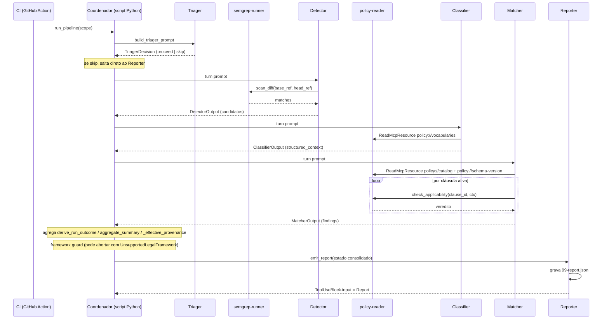
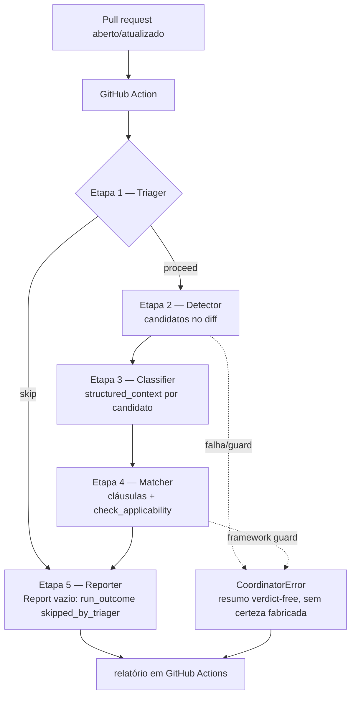

# Modelo de execução do sistema (as-built)

## 0. Cabeçalho

### Propósito

Este documento descreve **como o sistema se comporta quando executado**: o caminho que uma execução percorre, do *pull request* ao Report consolidado, e os contratos operacionais de cada componente *as-built*. É a **visão de execução** (dinâmica) do sistema — o par de *runtime* do [architecture-overview.md](docs/architecture-overview.md) (visão estrutural): descreve o que acontece quando o sistema roda, não como cada componente é implementado a partir do zero. Destina-se a quem precisa entender ou auditar a execução.

### O que é e o que não é

- **É** uma descrição do sistema construído (MVP completo), ancorada no código real.
- **Não é** fonte normativa de contrato. As especificações sob `docs/specs/` prevalecem sobre este texto em qualquer divergência de contrato. Este documento é **derivado e não-normativo**.

### Precedência de fontes

Ao ler este documento, a ordem de autoridade sobre fatos é: **código real** (as âncoras citadas em cada afirmação) > [docs/process/relatorio-tcc2.md](docs/process/relatorio-tcc2.md) §2.2–2.3 > [docs/architecture-overview.md](docs/architecture-overview.md) > especificações em [docs/specs/](docs/specs/). Onde a visão conceitual divergir do comportamento construído, este documento adota o **as-built** e o cita.

### Como ler

Cada afirmação que repousa em código carrega uma âncora inline no formato `[arquivo:linha](arquivo#Llinha)`. As tabelas-contrato trazem uma coluna final **Âncora**. A numeração de etapas vai de **1 (Triager)** a **5 (Reporter)**, coerente com a Figura 2 do relatório. Itens genuinamente incertos são marcados como **a confirmar**, nunca preenchidos por inferência.

### Proveniência

> **As-built, point-in-time.** Escrito contra o estado do repositório em 6 de junho de 2026 e verificado contra o *working tree* nessa data. As âncoras `arquivo:linha` são *point-in-time*: apontam o componente correto, mas o número da linha pode divergir após qualquer refatoração. Em caso de divergência, **o código vence** — a âncora indica onde olhar, não garante a linha. Trate este documento como um retrato datado, não como espelho contínuo do código.

> **Nota de numeração.** Este documento e o relatório numeram as etapas de 1 a 5. A *string* de saída ao usuário em [format_summary.py:51](scripts/ci/format_summary.py#L51) rotula o Triager como `(etapa 0)`, e o [architecture-overview.md](docs/architecture-overview.md) §3 usa 0–4. A divergência de numeração entre os três artefatos está registrada como débito cross-doc em [docs/tasks.md](docs/tasks.md) §Companion edits cross-doc.

---

## 1. Visão de uma execução

O caminho completo, de ponta a ponta, é: um *pull request* é aberto ou atualizado, a GitHub Action dispara, o coordenador (um *script* Python) executa cinco subagentes em sequência — Triager (etapa 1), Detector (2), Classifier (3), Matcher (4), Reporter (5) — e o resultado é um Report JSON, transcrito como relatório no *step summary* do GitHub Actions.

O ponto de entrada real da *pipeline* é a corrotina `run_pipeline` [run.py:327](src/coordinator/run.py#L327). Ela é chamada por vários consumidores: o gate *live* de avaliação [camada3_gate.py:76](eval/harness/camada3_gate.py#L76) (o caminho que de fato roda na CI — ver §9), harnesses de experimento, testes, e o adaptador de borda da produção [run_review.py:53](scripts/ci/run_review.py#L53) (dormente no MVP — ver §2.1). O pacote `coordinator` **não** expõe CLI nem `__main__`.

A *pipeline* é **sequencial** (cada etapa é aguardada com `await`), sem *fan-out* [run.py:358](src/coordinator/run.py#L358). O estado de uma etapa é passado à seguinte como **JSON embutido no prompt** da próxima chamada: os construtores `build_classifier_prompt`/`build_matcher_prompt`/`build_reporter_prompt` serializam, com `json.dumps`, o *output* Pydantic da etapa anterior [prompts.py:40](src/coordinator/prompts.py#L40); o `build_detector_prompt` interpola campos individuais e o `build_triager_prompt` usa um *template* [prompts.py:23](src/coordinator/prompts.py#L23). Os subagentes nunca leem o *scratchpad*; é o coordenador, em Python, que carrega os dados de uma etapa para a outra.

### Diagrama 1 — sequência de chamadas

### Diagrama 2 — fluxo das etapas (espelha a Figura 2 do relatório)

A Figura 2 cobre o caminho de sucesso. Este diagrama acrescenta, à direita, o terminal *fail-loud* (`CoordinatorError` → resumo *verdict-free*), que materializa a honestidade epistêmica descrita em §2.2 e §7.

---

## 2. Disparo e orquestração

### 2.1 GitHub Action

O *workflow* [.github/workflows/lgpd-review.yml](.github/workflows/lgpd-review.yml) declara dois *triggers*: `workflow_dispatch` e `pull_request` (`opened`/`synchronize`/`reopened`) [lgpd-review.yml:7](.github/workflows/lgpd-review.yml#L7). O *trigger* `pull_request` está **declarado, porém morto**: nenhum *job* ativo o consome.

- **Job ativo — `validate` (a gate):** roda como matriz dos três casos `COMP-001`/`VIOL-001`/`SKIP-001` [lgpd-review.yml:26](.github/workflows/lgpd-review.yml#L26), condicionado por `if github.event_name == 'workflow_dispatch'` [lgpd-review.yml:19](.github/workflows/lgpd-review.yml#L19). Executa `uv run python -m eval.harness.camada3_gate` e redireciona a saída padrão para `GITHUB_STEP_SUMMARY` [lgpd-review.yml:46](.github/workflows/lgpd-review.yml#L46). Instala Semgrep 1.163.0 via `uv tool install` (ADR-0010) [lgpd-review.yml:38](.github/workflows/lgpd-review.yml#L38) e fixa Python 3.12.7 [lgpd-review.yml:32](.github/workflows/lgpd-review.yml#L32).
- **Job de produção — `production-pr`:** **inerte** por `if: ${{ false }}` [lgpd-review.yml:58](.github/workflows/lgpd-review.yml#L58), com nome literal contendo *DEFERRED to Milestone D* [lgpd-review.yml:57](.github/workflows/lgpd-review.yml#L57). Só ela invocaria `scripts.ci.run_review` [lgpd-review.yml:80](.github/workflows/lgpd-review.yml#L80).
- **Permissões:** o *workflow* opera somente-leitor, `contents: read` [lgpd-review.yml:12](.github/workflows/lgpd-review.yml#L12).

O adaptador de borda [run_review.py](scripts/ci/run_review.py) e o renderizador [format_summary.py](scripts/ci/format_summary.py) **não têm chamador vivo no MVP** — são o conduto da produção de Milestone D, dormente. Quando ativado, `run_review` lê o ambiente (`BASE_REF`/`HEAD_REF`/`PR_NUMBER`/`REPO_URL`) [run_review.py:32](scripts/ci/run_review.py#L32), monta um `TriagerInput`, chama `run_pipeline` e escreve em *stdout*; os códigos de saída são 0 (`CoordinatorReport`), 1 (`CoordinatorError`) e 2 (má invocação) [run_review.py:61](scripts/ci/run_review.py#L61). O `format_summary.render_report_summary` produz o Markdown (título, `run_outcome`, linha de política, contagem por veredito, tabela de *findings*) [format_summary.py:30](scripts/ci/format_summary.py#L30) e o `render_error_summary` emite um bloco *verdict-free* — execução interrompida, sem certeza fabricada [format_summary.py:84](scripts/ci/format_summary.py#L84).

### 2.2 Coordenador

O coordenador é um **script Python, não um agente**. Não possui ferramenta de despacho de subagentes; ele faz **chamadas sequenciais ao Claude Agent SDK**, no padrão de encadeamento de *prompts*. Existem três espinhas de captura:

- `run_branch_b_stage` — **apenas o Triager**: `mcp_servers={}`, transporte `query()` *one-shot* [driver.py:125](src/coordinator/driver.py#L125).
- `_run_mcp_stage` — Detector/Classifier/Matcher: `ClaudeSDKClient` em *streaming*, com *readiness gate*, *reconnect* e *retry* (ADR-0014) [driver.py:192](src/coordinator/driver.py#L192).
- `_run_reporter_stage` — o Reporter, sempre (tanto no caminho *skip* quanto no *proceed*): `query()` próprio [run.py:253](src/coordinator/run.py#L253).

O *tail* compartilhado `_discriminate_and_capture` discrimina `refusal` → `subtype` → validação, valida o *structured output* no modelo Pydantic da etapa, roda o `verify_passthrough` quando há, e escreve o *scratchpad* [driver.py:67](src/coordinator/driver.py#L67). O *lockdown* por etapa fixa `permission_mode=dontAsk`, `setting_sources=[]`, `strict_mcp_config=True` [run.py:69](src/coordinator/run.py#L69); o `allowed_tools` estreito e o `output_format` (o *json_schema* do modelo Pydantic da etapa) são definidos por etapa, em cada `_*_options()` [run.py:182](src/coordinator/run.py#L182).

**Skip vs proceed.** É um *branch* Python: `if triager_out.decision == "skip"` o coordenador apenas registra o `skip_reason` e pula Detector/Classifier/Matcher [run.py:374](src/coordinator/run.py#L374). `derive_run_outcome` mapeia `skip_reason` não-nulo para `skipped_by_triager`.

**Quem agrega.** O **coordenador** agrega; o Reporter apenas serializa. As funções são `derive_run_outcome` [run.py:95](src/coordinator/run.py#L95), `aggregate_summary` [run.py:111](src/coordinator/run.py#L111), `_effective_provenance` — que deriva a trinca *top-level* de `findings[0]`, usando os parâmetros `policy_*` como *fallback* apenas nos caminhos sem *findings* [run.py:122](src/coordinator/run.py#L122) — e `_build_consolidated_state` [run.py:148](src/coordinator/run.py#L148).

**Toque mínimo no filesystem.** O coordenador **não lê** o *filesystem* para dados de política/MCP e **não chama** MCP diretamente (o acesso MCP existe só via `ClaudeAgentOptions.mcp_servers` dos subagentes). Seu único toque de FS é o *scratchpad* de auditoria, *write-only* [driver.py:55](src/coordinator/driver.py#L55). A única exceção é a leitura *pre-flight* do *header* da Política para o *guard* [run.py:342](src/coordinator/run.py#L342), espelhando o `resolve_policy_root` do servidor.

**Framework guard (ADR-0007).** O conjunto suportado é `_SUPPORTED_LEGAL_FRAMEWORKS = frozenset({"LGPD"})` [run.py:79](src/coordinator/run.py#L79). O *guard* dispara **tarde**, depois das quatro etapas e **antes** do Reporter: se o *framework* do *header* não for suportado, o coordenador levanta `UnsupportedLegalFramework(true_framework)` — cujo `stage` é `"framework_guard"` [errors.py:81](src/coordinator/errors.py#L81) — e **não emite** um Report rotulado erroneamente [run.py:443](src/coordinator/run.py#L443). O veredito por cláusula permanece observável na superfície do `policy-reader`.

**Terminação.** O resultado é `CoordinatorResult = CoordinatorReport | CoordinatorError` [models.py:18](src/coordinator/models.py#L18); o `CoordinatorError` carrega `cause`, `stage` (para atribuição de culpa) e `coverage_gap` em pt-BR. Toda exceção da taxonomia carrega `stage` [errors.py:13](src/coordinator/errors.py#L13). O *logging* é exclusivamente em *stderr* — *stdout* fica reservado ao Report [run.py:82](src/coordinator/run.py#L82).

---

## 3. As cinco etapas

A autoridade sobre quais *tools* cada subagente recebe vive no coordenador ([src/coordinator/run.py](src/coordinator/run.py)), via `allowed_tools` por etapa — não no pacote do subagente.

### Tabela-contrato

| Etapa | Responsabilidade | Tools/MCP | Entrada | Saída | Impedido de | Âncora |
| :--- | :--- | :--- | :--- | :--- | :--- | :--- |
| 1 — Triager | Decidir a relevância do PR | Read + Glob; `mcp_servers={}` | `TriagerInput` (escopo do PR) | `TriagerDecision` (`proceed`\|`skip`) | Bash/Grep/Write/Edit/MCP | [run.py:188](src/coordinator/run.py#L188) |
| 2 — Detector | Localizar pontos de tratamento candidatos no *diff* (não julga) | Read + `mcp__semgrep-runner__scan_diff` | `TriagerInput` + decisão do Triager | `DetectorOutput` (`findings` 5 campos + `ScanProvenance`) | policy-reader; Write/Edit/Bash | [run.py:200](src/coordinator/run.py#L200) |
| 3 — Classifier | Extrair contexto factual por candidato (descreve, não julga) | Read, Grep, ReadMcpResourceTool, ListMcpResourcesTool; só policy-reader | candidatos do Detector | `ClassifierOutput` (5 campos verbatim + `structured_context`) | Glob/Bash/Write/Edit; *tools* do policy-reader | [run.py:212](src/coordinator/run.py#L212) |
| 4 — Matcher | Avaliar conformidade e emitir vereditos | ListMcpResourcesTool, ReadMcpResourceTool + os 3 *tools* do policy-reader (`check_applicability`, `get_clause`, `find_clauses_by_law_article`); `max_turns=30` | `ClassifierOutput` | `MatcherOutput` (`findings` com `verdict` + trinca) | semgrep-runner; usa FS (Read concedida, mas vedada por prompt — ver nota) | [run.py:221](src/coordinator/run.py#L221) |
| 5 — Reporter | Chamar `emit_report` exatamente uma vez, verbatim | `mcp__reporter_tools__emit_report` (exclusiva) | estado consolidado pré-computado | `ReportPayload` (capturado de `ToolUseBlock.input`) | qualquer outra tool/MCP/FS | [run.py:287](src/coordinator/run.py#L287) |

### Narrativa por subagente

**Etapa 1 — Triager.** Responsabilidade única: decidir a relevância do PR [system_prompts.py:12](src/subagents/triager/system_prompts.py#L12). Roda com `system_prompt=None` (modo mínimo do SDK); o *prompt* canônico vai como *turn prompt* via `build_triager_prompt` [run.py:187](src/coordinator/run.py#L187). A entrada `TriagerInput` é a fonte única do escopo — `pr_number`, `base_ref`, `head_ref`, `repo_url` (este último é proveniência-only, não buscado no MVP) [models.py:20](src/subagents/triager/models.py#L20) — e é ecoada verbatim em `ReportPayload.scope`. A saída `TriagerDecision` tem `decision: Literal["proceed","skip"]`: `proceed` exige `relevance_summary`, `skip` exige `skip_reason` — XOR via `model_validator`, **não** na gramática de *wire* (DD-T16, para preservar o *constrained decoding*) [models.py:34](src/subagents/triager/models.py#L34). Vigora o princípio *proceed-on-doubt* [system_prompts.py:64](src/subagents/triager/system_prompts.py#L64).

**Etapa 2 — Detector.** Localiza candidatos no *diff*, sem julgar [system_prompts.py:11](src/subagents/detector/system_prompts.py#L11). A saída `DetectorFinding` tem cinco campos `extra=forbid`: `file`, `line`, `rule_id`, `snippet`, `surrounding_context` [models.py:19](src/subagents/detector/models.py#L19); o envelope `DetectorOutput` adiciona `findings` + `provenance: ScanProvenance` [models.py:46](src/subagents/detector/models.py#L46). O Detector **descarta a opinião do Semgrep** (severidade e mensagem da regra) e preserva localização + proveniência [models.py:3](src/subagents/detector/models.py#L3) — a severidade de conformidade é derivada adiante pelo Matcher. O *hook* `inspect_scan_diff_result` é um *backstop* passivo em `on_tool_result` (não `PreToolUse`) [hooks.py:36](src/subagents/detector/hooks.py#L36); a restrição de *tool* é declarativa via `allowed_tools`. É a **única etapa com *retry budget*** (`RETRY_BUDGET=1`), por causa do `scan_diff` [run.py:386](src/coordinator/run.py#L386).

**Etapa 3 — Classifier.** Extrai contexto factual por candidato; **descreve, não julga** [system_prompts.py:12](src/subagents/classifier/system_prompts.py#L12). Lê `policy://vocabularies` como **resource** (sem as *tools* do policy-reader) [constants.py:11](src/subagents/classifier/constants.py#L11). O `EXAMPLES_URI` (`policy://examples`) é **opcional**: em produção é ausente/erro/vazio, tratado identicamente, sem improvisar *tokens* [constants.py:12](src/subagents/classifier/constants.py#L12). A saída `StructuredContext` tem quatro campos: `operation_type` (`str|None`), `declared_legal_basis` (`str|None`, *required*+*nullable* — *miss* = `null` auditável), `data_categories` (`list[str]`, default `[]`) e `declared_transformations` (`list[str]`, default `[]`) [models.py:19](src/subagents/classifier/models.py#L19). O vocabulário governa **softly** três campos (`operation_type`, `data_categories`, `declared_legal_basis`) — instrução de *prompt* + *null-on-miss*; o Matcher é a autoridade de *membership* [system_prompts.py:23](src/subagents/classifier/system_prompts.py#L23). `declared_transformations` é livre (hash/cripto/anonimização são termos universais). O `ClassifiedCandidate` = os 5 campos do Detector verbatim + `structured_context` [models.py:28](src/subagents/classifier/models.py#L28). O *passthrough* posicional de 5 campos é verificado **no coordenador**: qualquer *drift* levanta `SubagentContractViolation(stage="classifier")` [passthrough.py:22](src/subagents/classifier/passthrough.py#L22).

**Etapa 4 — Matcher.** Único subagente autorizado a invocar as *tools* do policy-reader e único a emitir vereditos [run.py:221](src/coordinator/run.py#L221). O mecanismo interino *check-all* lê `policy://catalog` + `policy://schema-version` (não `policy://vocabularies`) [constants.py:12](src/subagents/matcher/constants.py#L12), mantém cláusulas com `status == active`, projeta campos (`operation_type`→`operation`, `declared_legal_basis`→`legal_basis`, mantém `data_categories`, descarta `declared_transformations`) [system_prompts.py:33](src/subagents/matcher/system_prompts.py#L33) e chama `check_applicability` por cláusula ativa; aplica *short-circuit* `not_applicable(POL-000)` se `operation_type` for nulo ou `data_categories` vazio [system_prompts.py:29](src/subagents/matcher/system_prompts.py#L29). `get_clause` e `find_clauses_by_law_article` são concedidas, mas não exercidas pelo mecanismo *prompted*. A saída `Finding` é enum-*tag* por `verdict` (não `oneOf` de *wire*, DD-M13) [models.py:43](src/subagents/matcher/models.py#L43), com `verdict: Literal` dos quatro [models.py:22](src/subagents/matcher/models.py#L22); por veredito, `compliant`/`violation_candidate` exigem `evidence` (`violation_candidate` tem `contradicted_requirement` opcional), `indeterminate` exige `verification_scope` (objeto `dimension`/`prescribed_treatment`/`verification_target`), `not_applicable` exige `reason` [models.py:69](src/subagents/matcher/models.py#L69). O campo `policy_clause_ref` (POL-NNN) é obrigatório nos quatro [models.py:56](src/subagents/matcher/models.py#L56). A trinca por *finding* vem verbatim do `check_applicability`: `policy_schema_version`, `policy_version`, `legal_framework: Literal["LGPD"]` [models.py:57](src/subagents/matcher/models.py#L57). O *finding* carrega ainda `requires_human_review: bool | None`, originado pelo Matcher como sinal de escalonamento humano — sua **ausência não equivale a `false`** (DD-M29) [models.py:62](src/subagents/matcher/models.py#L62). MVP *collection-only*: só a operação `collection` é avaliada; as demais → `not_applicable` [system_prompts.py:45](src/subagents/matcher/system_prompts.py#L45).

> **Nota — Matcher e o filesystem.** A `Read` é concedida ao Matcher no nível do SDK [run.py:224](src/coordinator/run.py#L224), mas o *system prompt* o direciona a confiar **apenas** no `structured_context` recebido do Classifier — o Matcher não lê o *filesystem* na prática. O Quadro 1 do relatório e a matriz abaixo refletem essa intenção de projeto (Read em branco para o Matcher), não a concessão literal de *tool*.

**Etapa 5 — Reporter.** Terminal. Sua **única** função é chamar `emit_report` **exatamente uma vez** com o estado consolidado pré-computado pelo coordenador, copiando tudo verbatim — não recomputa `run_outcome`/`summary`, não reordena nem filtra *findings* [system_prompts.py:10](src/subagents/reporter/system_prompts.py#L10). A *tool* exclusiva é `emit_report` (`mcp__reporter_tools__emit_report`), servidor **in-process** via `create_sdk_mcp_server` — **não** FastMCP/stdio — porque precisa capturar `run_path` + `expected_report_id` em *closure* (escopo Python compartilhado), inviável em subprocesso [tools.py:206](src/subagents/reporter/tools.py#L206). A saída `ReportPayload` é `extra=forbid` com `report_id` (uuid4), `report_schema_version`/`policy_schema_version`/`policy_version` (semver), `legal_framework: Literal["LGPD"]`, `run_outcome` (Literal dos 4), `triager_skip_reason` (`str|None`, *required*), `scope` (`TriagerInput`), `summary` (`counts`+`total`), `findings` e `scan_provenance` opcional [models.py:54](src/subagents/reporter/models.py#L54). `Finding` e `ScanProvenance` são **importados** dos módulos produtores (matcher/detector) como fonte única (ADR-0001 D3) [models.py:23](src/subagents/reporter/models.py#L23). O Reporter **não** usa `output_format` *json_schema* (diferente das quatro etapas anteriores) — o *schema* vem do `inputSchema` da *tool* `emit_report`. A captura no coordenador lê `ToolUseBlock.input` (o que o modelo emitiu), não o `ToolResult` [run.py:287](src/coordinator/run.py#L287).

### Matriz tools × subagente

Espelha o Quadro 1 do relatório. O coordenador **não aparece** — não é um agente dotado de *tools*. A linha Write/Edit/Bash é inteiramente vazia: o sistema é somente-leitor.

| Tool / Recurso | Triager | Detector | Classifier | Matcher | Reporter | Âncora |
| :--- | :---: | :---: | :---: | :---: | :---: | :--- |
| Read | ✓ | ✓ | ✓ | (✓)¹ | | [run.py:188](src/coordinator/run.py#L188) |
| Glob | ✓ | | | | | [run.py:188](src/coordinator/run.py#L188) |
| Grep | | | ✓ | | | [run.py:212](src/coordinator/run.py#L212) |
| Write / Edit / Bash | | | | | | — |
| `semgrep-runner` (MCP) | | ✓ | | | | [run.py:200](src/coordinator/run.py#L200) |
| `policy-reader` — *tools* | | | | ✓ | | [run.py:221](src/coordinator/run.py#L221) |
| `policy://catalog` + `policy://schema-version` | | | | ✓ | | [constants.py:12](src/subagents/matcher/constants.py#L12) |
| `policy://vocabularies` (resource) | | | ✓ | | | [constants.py:11](src/subagents/classifier/constants.py#L11) |
| `policy://examples` (resource, opcional)² | | | ✓ | | | [constants.py:12](src/subagents/classifier/constants.py#L12) |
| `emit_report` (custom) | | | | | ✓ | [tools.py:206](src/subagents/reporter/tools.py#L206) |

¹ Read é concedida ao Matcher no SDK [run.py:224](src/coordinator/run.py#L224), mas vedada por *system prompt* (ver nota acima).
² `policy://examples` é lida pelo Classifier apenas quando exposta (enriquecimento experimental, *default* desligado); em produção é tratada como ausente.

---

## 4. Servidores MCP

### 4.1 policy-reader

Servidor FastMCP *stdio*, nome `policy-reader` [server.py:34](src/mcp_servers/policy_reader/server.py#L34); *entry* `__main__` → `_bootstrap` → `mcp.run()` [server.py:285](src/mcp_servers/policy_reader/server.py#L285). Expõe **exatamente 3 resources** — `policy://catalog` (*Policy Clause Catalog*), `policy://vocabularies` (*Jurisdictional Vocabularies*), `policy://schema-version` (*Policy Schema Handshake*) [server.py:69](src/mcp_servers/policy_reader/server.py#L69) — e **exatamente 3 tools**: `get_clause(clause_id)`, `find_clauses_by_law_article(lei, artigo, paragrafo?, inciso?, alinea?)`, `check_applicability(clause_id, structured_context)` [server.py:144](src/mcp_servers/policy_reader/server.py#L144).

`policy://vocabularies` retorna **cinco chaves**: quatro jurisdicionais (`operation`, `lawful_basis`, `control`, `out_of_scope`) + uma estrutural `data_categories` composta de POL-000 (o *framework* é omitido) [tools.py:119](src/mcp_servers/policy_reader/tools.py#L119). Os vocabulários são lidos de `policy/vocabularies/<legal_framework>/` (framework-agnóstico) [loader.py:113](src/mcp_servers/policy_reader/loader.py#L113). `policy://schema-version` retorna `policy_schema_version`, `policy_version`, `legal_framework` + `compatible_schema_range` [server.py:131](src/mcp_servers/policy_reader/server.py#L131).

**Fail-fast de compatibilidade.** O `compatible_schema_range` é validado no *load* e **aborta o boot** se fora do range: `COMPATIBLE_SCHEMA_RANGE = SpecifierSet(">=0.1.0,<0.2.0")`; `_load_header` levanta `PolicyLoadError` fora do range, e o `_bootstrap` imprime em *stderr* e faz `sys.exit(1)` antes do `mcp.run()` [loader.py:41](src/mcp_servers/policy_reader/loader.py#L41). Há *check* duplicado: cada cláusula carrega um `policy_schema_version` redundante, validado contra o mesmo range [loader.py:154](src/mcp_servers/policy_reader/loader.py#L154).

**Taxonomia de erro — exatamente 7 errorCodes** (em 3 classes: *validation*/*business*/*system*), com Option B [_envelope.py:61](src/mcp_servers/policy_reader/_envelope.py#L61):

| errorCode | isRetryable | Âncora |
| :--- | :---: | :--- |
| `INVALID_CLAUSE_ID_FORMAT` | False | [_envelope.py:61](src/mcp_servers/policy_reader/_envelope.py#L61) |
| `CLAUSE_NOT_FOUND` | False | [_envelope.py:76](src/mcp_servers/policy_reader/_envelope.py#L76) |
| `INVALID_LAW_IDENTIFIER` | False | [_envelope.py:85](src/mcp_servers/policy_reader/_envelope.py#L85) |
| `CLAUSE_DEPRECATED` | **True** (único) | [_envelope.py:103](src/mcp_servers/policy_reader/_envelope.py#L103) |
| `INVALID_DATA_CATEGORY` | False | [_envelope.py:130](src/mcp_servers/policy_reader/_envelope.py#L130) |
| `INVALID_OPERATION` | False | [_envelope.py:149](src/mcp_servers/policy_reader/_envelope.py#L149) |
| `EMPTY_DATA_CATEGORIES` | False | [_envelope.py:167](src/mcp_servers/policy_reader/_envelope.py#L167) |

A `message` é em pt-BR, o `errorCode` em inglês; `accepted_values` é dinâmico (de POL-000 e dos vocabulários), não *hard-coded*.

### 4.2 semgrep-runner

Servidor FastMCP *stdio*, nome `semgrep-runner` [server.py:30](src/mcp_servers/semgrep_runner/server.py#L30). A *tool* `scan_diff(base_ref, head_ref)` retorna um `ToolResult` [server.py:75](src/mcp_servers/semgrep_runner/server.py#L75); a implementação está em [tools.py:275](src/mcp_servers/semgrep_runner/tools.py#L275). A saída de sucesso `ScanSuccessPayload` traz `rules_version`, `semgrep_version`, `scan_metadata` (`base_ref`/`head_ref` SHA-1 de 40 chars, `files_scanned`, `elapsed_seconds`) e `findings[]` com `rule_id`, `rule_severity`, `rule_message`, `location` (`path`, *start/end line/col* 1-indexed) e `snippet` [models.py:110](src/mcp_servers/semgrep_runner/models.py#L110).

**Exatamente 6 errorCodes** [_envelope.py:78](src/mcp_servers/semgrep_runner/_envelope.py#L78):

| errorCode | classe | isRetryable | Âncora |
| :--- | :--- | :---: | :--- |
| `GIT_REF_NOT_FOUND` | business | False | [_envelope.py:78](src/mcp_servers/semgrep_runner/_envelope.py#L78) |
| `INSUFFICIENT_GIT_HISTORY` | business | False | [_envelope.py:103](src/mcp_servers/semgrep_runner/_envelope.py#L103) |
| `SCAN_TIMEOUT` | system | **True** | [_envelope.py:121](src/mcp_servers/semgrep_runner/_envelope.py#L121) |
| `SEMGREP_BINARY_UNAVAILABLE` | system | False | [_envelope.py:144](src/mcp_servers/semgrep_runner/_envelope.py#L144) |
| `SEMGREP_EXECUTION_FAILED` | system | **True** | [_envelope.py:162](src/mcp_servers/semgrep_runner/_envelope.py#L162) |
| `INVALID_RULE_SET` | system | False | [_envelope.py:190](src/mcp_servers/semgrep_runner/_envelope.py#L190) |

O `INSUFFICIENT_GIT_HISTORY` tem detecção em duas camadas: *proativa* (`git rev-parse --is-shallow-repository`) e *lazy* (inspeção da mensagem de erro do Semgrep por sinais de *shallow*/*merge-base*) [tools.py:82](src/mcp_servers/semgrep_runner/tools.py#L82).

**Pack BR — exatamente 6 regras** em [mcp_servers/semgrep_runner/rules/](mcp_servers/semgrep_runner/rules/) (na raiz do repositório, fora de `src/`): `br_cnh`, `br_cnpj`, `br_cns_saude`, `br_cpf`, `br_nis_pis`, `br_titulo_eleitor` — CNH, CNPJ, CNS-saúde, CPF, NIS/PIS e título de eleitor. O `snippet` é lido do *filesystem* local pelo *runner* (não do *output* do Semgrep) [tools.py:109](src/mcp_servers/semgrep_runner/tools.py#L109). O `rules_version` é um *hash* sha256 do conteúdo [loader.py:76](src/mcp_servers/semgrep_runner/loader.py#L76). O binário `semgrep` é checado **por chamada** via `shutil.which` (não no *startup*; ADR-0010) [tools.py:298](src/mcp_servers/semgrep_runner/tools.py#L298). A resolução da raiz das regras é: argumento > `SEMGREP_RUNNER_ROOT` > `<repo>/mcp_servers/semgrep_runner/rules` [loader.py:36](src/mcp_servers/semgrep_runner/loader.py#L36).

**Endurecimento Windows-stdio.** Os três subprocessos usam `stdin=subprocess.DEVNULL` [tools.py:152](src/mcp_servers/semgrep_runner/tools.py#L152), [tools.py:173](src/mcp_servers/semgrep_runner/tools.py#L173), [tools.py:340](src/mcp_servers/semgrep_runner/tools.py#L340). A decisão está registrada em ADR-0011 (PR #59).

### 4.3 emit_report — in-process vs stdio

O contraste é deliberado: um servidor MCP *stdio* (como `policy-reader` e `semgrep-runner`) é um **processo local** que comunica por *stdin*/*stdout*; um servidor via `create_sdk_mcp_server` define *tools* **no próprio código da aplicação**, necessário quando há **captura de escopo** (*closure*). O `emit_report` é o segundo caso: precisa do `run_path` + `expected_report_id` capturados em *closure*, o que é inviável em subprocesso [tools.py:1](src/subagents/reporter/tools.py#L1). Documentado em [reporter.md:45](docs/specs/subagents/reporter.md#L45) e no relatório §2.4.

---

## 5. Contratos de dados e proveniência

A cadeia de modelos atravessa as cinco etapas: `DetectorFinding` (5 campos de *locus*) → `StructuredContext` (4 campos) → `Finding` (`verdict` + trinca + variantes) → `ReportPayload` [detector/models.py:19](src/subagents/detector/models.py#L19), [classifier/models.py:19](src/subagents/classifier/models.py#L19), [matcher/models.py:43](src/subagents/matcher/models.py#L43), [reporter/models.py:54](src/subagents/reporter/models.py#L54). O transporte inter-etapa é **JSON embutido no prompt seguinte**, não passagem de objeto tipado [prompts.py:40](src/coordinator/prompts.py#L40).

**O *hop* Classifier→Matcher é *lossy*.** O `Finding` mantém o *locus* (`file`/`line`/`snippet`/`rule_id`) e `data_categories`+`operation_type`, mas **descarta** `declared_legal_basis`, `declared_transformations` e também `surrounding_context`, e estreita `operation_type` de `str|None` para `str` [matcher/models.py:51](src/subagents/matcher/models.py#L51). A propriedade verbatim vale para Matcher→Reporter (`Finding` importado, ADR-0001 D3), **não** para Classifier→Matcher.

**Trinca de proveniência.** Nasce no policy-reader (`_provenance_from`, verbatim do *header*) [_envelope.py:189](src/mcp_servers/policy_reader/_envelope.py#L189); é anexada por veredito no *boundary* MCP, nos quatro *verdict models* [models.py:239](src/mcp_servers/policy_reader/models.py#L239); cruza *per-finding* no `Finding` com `legal_framework: Literal["LGPD"]` [matcher/models.py:57](src/subagents/matcher/models.py#L57); e o *top-level* do Report é derivado de `findings[0]` pelo coordenador (`_effective_provenance`), mantendo *top-level* == *per-finding* por construção (o *cross-check* #2 do Reporter) [run.py:122](src/coordinator/run.py#L122).

**Atenção à terminologia.** A trinca **não** é "versionamento em três eixos". O versionamento é em **dois eixos semver** — `policy_schema_version` (esquema estrutural) e `policy_version` (conteúdo das cláusulas). O `legal_framework` é um **eixo de identidade**, não-semver, de valor único ([SCHEMA.md:71](policy/SCHEMA.md#L71); ADR-0005). A trinca de proveniência apenas *empacota* os três — os dois semver + o de identidade — para auditoria temporal e jurisdicional. (O relatório fala em "identidade em três eixos": é compatível — dois eixos de versionamento mais um de identidade somam três eixos de **identidade**. A proibição aqui é apenas à leitura de que os três seriam eixos de *versionamento*.)

Há um segundo eixo de proveniência, ortogonal: o `ScanProvenance` (*per-scan*, originado no Detector), carregado em `Report.scan_provenance` [run.py:391](src/coordinator/run.py#L391).

**run_outcome** (quatro valores, distintos dos quatro vereditos): `success_with_findings`, `success_no_candidates`, `success_all_not_applicable`, `skipped_by_triager` [reporter/models.py:27](src/subagents/reporter/models.py#L27).

---

## 6. Vereditos e honestidade epistêmica

Os **quatro vereditos** são `compliant`, `violation_candidate`, `indeterminate` e `not_applicable`. Eles são decididos no `check_applicability` do policy-reader, em ordem *fail-fast*: formato do `clause_id` → `data_categories` vazio → categoria inválida → operação inválida → validação do `StructuredContext` → cláusula não encontrada → *deprecated* → cláusula *definitional* ⇒ `not_applicable` → `operation != collection` ⇒ `not_applicable` (MVP, ADR-0007) → *mismatch* de aplicabilidade ⇒ `not_applicable` → `_verdict_for_control` [tools.py:281](src/mcp_servers/policy_reader/tools.py#L281).

`_verdict_for_control` suporta dois *controls* no MVP [tools.py:411](src/mcp_servers/policy_reader/tools.py#L411): `consent_required` (compara `context.legal_basis` ao *token* `consent` → `compliant`/`violation_candidate`) e `anonymization_required` (**sempre** `indeterminate` — o estado *upstream* não é decidível por análise estática de PR). Qualquer outro *control* → `AssertionError` (*fail loud*).

O `indeterminate` é veredito de **primeira classe** e carrega `verification_scope`, apontando a dimensão a verificar manualmente. A conformidade é **declarativa, não efetiva**: o sistema lê o que o código declara, não o que roda em produção. O `clause_id` — campo `policy_clause_ref` no modelo — é **obrigatório em todos os vereditos**, inclusive `not_applicable`, preservando o *audit trail* da cláusula avaliada-e-descartada.

> **Nota de nomenclatura.** A regra imutável é "toda *finding* cita o `clause_id` estável (POL-NNN)". No código, o campo do *finding* chama-se `policy_clause_ref` [matcher/models.py:56](src/subagents/matcher/models.py#L56) e está presente nos quatro vereditos; o *token* `clause_id` é o nome do **argumento** da *tool* `check_applicability`. São o mesmo conceito sob nomes distintos por camada.

---

## 7. Erros e bordas

**policy-reader (Option B).** São 7 errorCodes (§4.1). Em todos os retornos — sucesso, vazio e erro de domínio — o *wire* traz `isError: false` (ADR-0002 §3) [_envelope.py:11](src/mcp_servers/policy_reader/_envelope.py#L11). A discriminação sucesso-vs-erro se faz pela **presença de `errorCode` em `structuredContent`**, NÃO pelo *flag* `isError` — checar `isError` nesses servidores sempre vê `false` e perde o erro.

**emit_report (SDK @tool in-process) é diferente.** Sinaliza erro com `is_error` (snake_case) nativo — o *flag* **é** o discriminador e sobrevive ao *stream*. O `structuredContent` é **dropado** no *bridge* do SDK (tanto no sucesso quanto no erro), então o *payload* estruturado vai serializado em `content` (string JSON) [tools.py:58](src/subagents/reporter/tools.py#L58). Antes de gravar, o *handler* valida o *payload* via Pydantic (`PYDANTIC_VALIDATION`, *Step 1*) [tools.py:80](src/subagents/reporter/tools.py#L80) e então roda os *cross-checks*: `REPORT_ID_MISMATCH` primeiro (*Step 2*) [tools.py:180](src/subagents/reporter/tools.py#L180), seguido — em `_run_cross_checks` [tools.py:92](src/subagents/reporter/tools.py#L92) — de `CLAUSE_REF_FORMAT` (`^POL-\d{3}$` por *finding*), `PROVENANCE_MISMATCH` (trinca *top-level* == *per-finding*) e `COUNTS_DISAGREE_WITH_FINDINGS`/`TOTAL_NOT_SUM_OF_COUNTS`. A superfície de erro do `emit_report` é, portanto, de seis errorCodes.

**Guard de dupla emissão (ADR-0016).** O coordenador conta emissões **com sucesso** — sinalizadas pela presença do `99-report.json` [run.py:280](src/coordinator/run.py#L280): uma 2ª emissão **após sucesso** → `MultipleReportEmissions`; uma 2ª **após falha** (sem *sink*) é *retry* de validação legítimo e **não** levanta; se nunca emitiu → `ReportNotEmitted`.

**semgrep-runner.** São 6 errorCodes (§4.2). **Resultado vazio NÃO é erro** — uma lista sem *findings* é informação acionável. Repositório *shallow* → `INSUFFICIENT_GIT_HISTORY`.

**Fail-loud de framework.** *Framework* não suportado leva a `UnsupportedLegalFramework` no coordenador (ADR-0007) [run.py:443](src/coordinator/run.py#L443); `compatible_schema_range` fora do range **aborta o boot** do policy-reader. E o `indeterminate` é **resposta legítima, não erro** [tools.py:479](src/mcp_servers/policy_reader/tools.py#L479).

---

## 8. Fronteiras do MVP

- O *job* de produção por `pull_request` está **diferido e inerte** (`if: false`, Milestone D); a *gate* roda por `workflow_dispatch` [lgpd-review.yml:58](.github/workflows/lgpd-review.yml#L58).
- **MVP *collection-only*** (ADR-0007): só a operação `collection` é avaliada contra cláusulas; as demais → `not_applicable` com razão explícita de escopo [system_prompts.py:45](src/subagents/matcher/system_prompts.py#L45).
- **Informativo, não bloqueante**: o sistema não bloqueia *merge* — coerente com o *workflow* somente-leitor (`contents: read`) e a job de produção inerte.
- **Conformidade declarativa, não efetiva**: lê o que o código declara, não o que de fato roda em produção (ver `anonymization_required` sempre `indeterminate`, §6).
- **PR-scoped, não *system-wide***: analisa o *diff* do PR, não o repositório inteiro.
- A Política do produto traz **apenas POL-000** (definitional, vocabulário universal); cláusulas substantivas são autoradas por-cliente.

---

## 9. Como o funcionamento é verificado

A verificação opera em duas camadas, ambas descritivas (não reproduzo contagens aqui — para números atualizados, ver [docs/process/](docs/process/)).

**Gate *live* da Camada-3.** O [camada3_gate.py](eval/harness/camada3_gate.py) (`main` [camada3_gate.py:139](eval/harness/camada3_gate.py#L139); `_run_case` [camada3_gate.py:76](eval/harness/camada3_gate.py#L76)) roda a *pipeline* real — `run_pipeline` + SDK + ambos os servidores MCP — sobre um PR sintético, e compara o Report contra um *baseline* commitado (`.expected-report.json`), *field-scoped* STRICT [camada3_compare.py:70](eval/harness/camada3_compare.py#L70). Há **três casos** no *gate*/CI: `COMP-001`, `VIOL-001`, `SKIP-001` [camada3_gate.py:56](eval/harness/camada3_gate.py#L56).

**Motor determinístico.** O [run_engine_cases.py](eval/harness/run_engine_cases.py) (`main` [run_engine_cases.py:338](eval/harness/run_engine_cases.py#L338)) exercita a lógica dos quatro vereditos **sem modelo nem MCP**, e **reusa** (sem reimplementar) `derive_run_outcome`/`aggregate_summary`/`_build_consolidated_state` do coordenador para montar Reports validados contra `ReportPayload` [run_engine_cases.py:225](eval/harness/run_engine_cases.py#L225). O catálogo de casos é o [eval/cases.yaml](eval/cases.yaml) (prefixos COMP/VIOL/INDET/NA/B-/PROBE-UNGOV/SWAP/SKIP). A avaliação carrega `policies/eval-lgpd` e `policies/eval-gdpr`, **não** o *seed* `policy/`.

Para números de teste e de resultado — contagens da suíte, evidências de *gate* e QA — a fonte é [docs/process/](docs/process/) (`relatorio-qa.md`, `camada3-mvp.md`, `milestoneA.md`/`milestoneB.md`); não reproduzir aqui valores que possam envelhecer.
