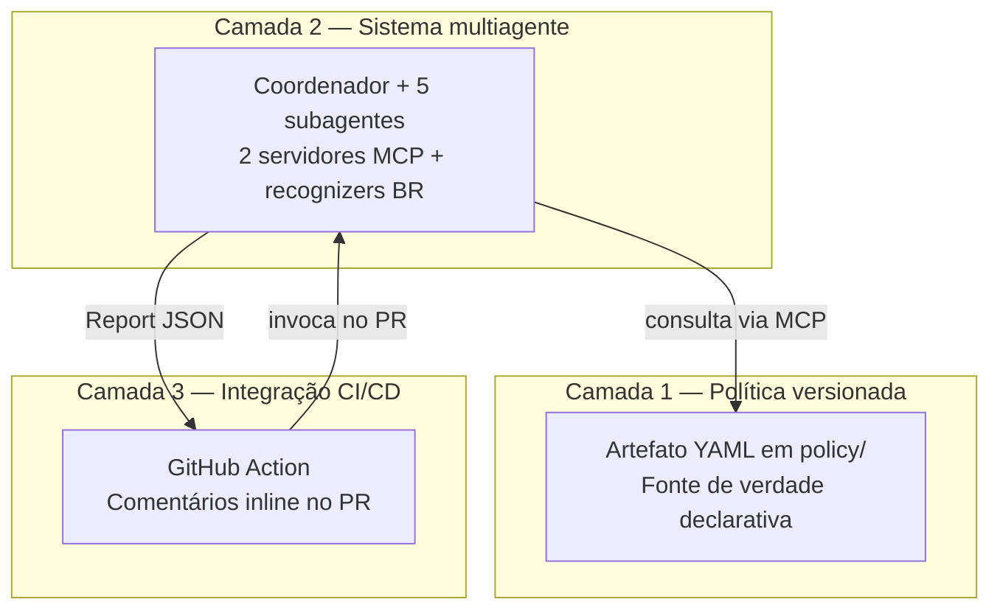
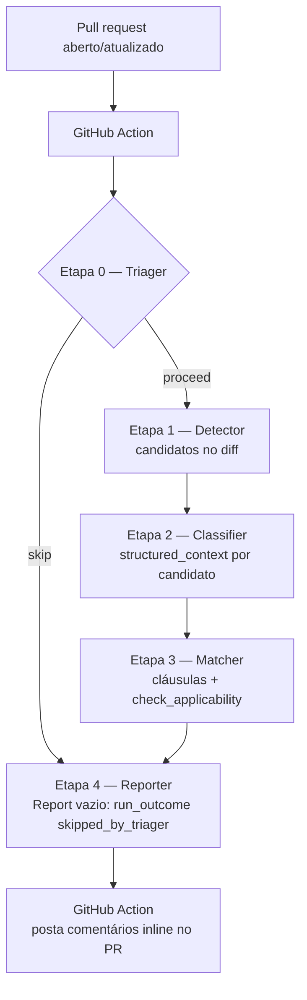

<!--
RELATÓRIO TÉCNICO DE TCC2 (fonte Markdown)
Este arquivo é a fonte em Markdown do relatório técnico. O entregável institucional formatado
(ABNT: capa, folha de rosto, termo de aprovação, numeração de páginas, figuras rasterizadas) é gerado
em .docx a partir deste conteúdo.
Convenções:
- Fontes externas em ABNT autor-data: (AUTOR, ano); disambiguação ANTHROPIC 2024a/2024b/2025a/2025b/2026 na seção REFERÊNCIAS.
- Artefatos do próprio software (specs, ADRs, architecture-overview, REQUIREMENTS, DESIGN, proposta, planejamento)
  citados por nome + seção; entram como APÊNDICES, não nas referências bibliográficas.
- Figuras em Mermaid (renderizam no GitHub); no .docx são substituídas pelos PNGs correspondentes (ver figura1-arquitetura, figura2-fluxo).
- Dispositivos da LGPD (Lei nº 13.709/2018) verificados no texto oficial (Planalto).
-->

# Da lei ao *pull request*: um sistema multiagente dirigido por uma Política de Proteção de Dados versionada

**Autor:** João Guilherme de Mello Paiva Pereira
**Curso:** Engenharia de Software — Universidade Tecnológica Federal do Paraná (UTFPR), Câmpus Dois Vizinhos
**Orientadora:** Profa. Alinne Cristinne Corrêa Souza
**Modalidade:** Relatório Técnico de TCC2
**Local e ano:** Dois Vizinhos, 2026

> *Os elementos pré-textuais institucionais — capa, folha de rosto e termo de aprovação — são formatados na versão final em `.docx`, conforme o modelo da UTFPR Câmpus Dois Vizinhos.*

---

## RESUMO

PEREIRA, João Guilherme de Mello Paiva. Da lei ao *pull request*: um sistema multiagente dirigido por uma Política de Proteção de Dados versionada. 2026. ___ f. Trabalho de Conclusão de Curso (Bacharelado em Engenharia de Software) – Universidade Tecnológica Federal do Paraná. Dois Vizinhos, 2026.

A Lei Geral de Proteção de Dados Pessoais impõe obrigações sobre o tratamento de dados pessoais que precisam ser verificadas no próprio código de aplicação. Este trabalho apresenta o projeto e a implementação de um sistema de *code review* automatizado que, integrado a *pull requests*, verifica a conformidade do tratamento de dados pessoais com uma Política versionada. A contribuição central é tratar essa Política como artefato declarativo de primeira classe — um arquivo estruturado, versionado, que codifica obrigações de proteção de dados em cláusulas verificáveis, independente tanto do mecanismo que a interpreta quanto da jurisdição que codifica, sendo a LGPD a instância exemplar. O sistema organiza-se em três camadas: a Política versionada; um sistema multiagente composto por um coordenador e cinco subagentes especializados, apoiado por dois servidores que implementam o *Model Context Protocol*; e a integração com o GitHub Actions. A metodologia adotada é o *Spec-Driven Development*, com calibração da granularidade de decomposição e verificação em dois escopos. Como diferencial técnico, o sistema reconhece identificadores brasileiros — CPF, CNPJ, CNH, NIS/PIS, título de eleitor e CNS-saúde —, endereçando lacuna das ferramentas internacionais. As três camadas foram implementadas e validadas: a Política versionada, os dois servidores de acesso e detecção — incluindo os reconhecedores brasileiros — e o sistema multiagente, este exercitado de ponta a ponta sobre *pull requests* sintéticos e integrado ao GitHub Actions, com portão de marco aprovado tanto em execução local quanto em integração contínua. A avaliação empírica do motor de conformidade converge campo a campo entre execuções independentes no núcleo reprodutível de casos e escala honestamente — emitindo o veredito `indeterminate` ou recusando-se a rotular o que não pode afirmar — na fronteira em que a análise estática não decide. Conclui-se pela viabilidade da abordagem, demonstrada empiricamente no nível da decisão de conformidade dirigida pela Política, com as fronteiras de escopo do produto mínimo viável declaradas com precisão.

**Palavras-chave:** Proteção de dados pessoais. LGPD. Análise estática de código. Sistemas multiagentes. Model Context Protocol.

## ABSTRACT

PEREIRA, João Guilherme de Mello Paiva. From statute to *pull request*: a multi-agent system driven by a versioned data protection policy. 2026. ___ p. Trabalho de Conclusão de Curso (Bacharelado em Engenharia de Software) – Federal Technology University – Parana. Dois Vizinhos, 2026.

The Brazilian General Data Protection Law imposes obligations on the processing of personal data that must be verified in the application code itself. This work presents the design and implementation of an automated code review system that, integrated into pull requests, verifies the compliance of personal data processing against a versioned Policy. The central contribution is to treat this Policy as a first-class declarative artifact — a structured, versioned file that encodes data protection obligations as verifiable clauses, independent of both the mechanism that interprets it and the jurisdiction it encodes, with the LGPD as the exemplary instance. The system is organized in three layers: the versioned Policy; a multi-agent system composed of a coordinator and five specialized subagents, supported by two servers implementing the Model Context Protocol; and integration with GitHub Actions. The methodology is Spec-Driven Development, with calibrated decomposition granularity and two-scope verification. As a technical differentiator, the system recognizes Brazilian identifiers — CPF, CNPJ, CNH, NIS/PIS, voter registration and health card —, addressing a gap in international tools. All three layers have been implemented and validated: the versioned Policy, the two access and detection servers — including the Brazilian recognizers — and the multi-agent system, the latter exercised end-to-end over synthetic pull requests and integrated with GitHub Actions, with a milestone gate passing both locally and in continuous integration. The empirical evaluation of the compliance engine converges field-by-field across independent runs on the reproducible core of cases and escalates honestly — emitting the `indeterminate` verdict or refusing to label what it cannot assert — on the frontier where static analysis does not decide. The approach is concluded to be viable, demonstrated empirically at the level of the Policy-driven compliance decision, with the minimum-viable-product scope boundaries declared precisely.

**Keywords:** Personal data protection. LGPD. Static code analysis. Multi-agent systems. Model Context Protocol.

## LISTA DE FIGURAS

- Figura 1 — Arquitetura em três camadas
- Figura 2 — Fluxo de execução do sistema multiagente

## LISTA DE QUADROS

- Quadro 1 — Ferramentas e recursos por subagente
- Quadro 2 — Pilha tecnológica e governança
- Quadro 3 — Taxonomia dos casos de avaliação
- Quadro 4 — Portões de verificação aprovados
- Quadro 5 — Cronograma consolidado

## LISTA DE SIGLAS E ABREVIATURAS

| Sigla | Significado |
| :--- | :--- |
| ABNT | Associação Brasileira de Normas Técnicas |
| ADR | *Architecture Decision Record* (registro de decisão arquitetural) |
| CDC | Código de Defesa do Consumidor |
| CI/CD | *Continuous Integration / Continuous Delivery* (integração e entrega contínuas) |
| CNH | Carteira Nacional de Habilitação |
| CMN | Conselho Monetário Nacional |
| CNPJ | Cadastro Nacional da Pessoa Jurídica |
| CNS | Cartão Nacional de Saúde |
| CPF | Cadastro de Pessoas Físicas |
| GDPR | *General Data Protection Regulation* (Regulamento Geral de Proteção de Dados, União Europeia) |
| JSON | *JavaScript Object Notation* |
| LGPD | Lei Geral de Proteção de Dados Pessoais |
| MCP | *Model Context Protocol* |
| MVP | *Minimum Viable Product* (produto mínimo viável) |
| NIS/PIS | Número de Identificação Social / Programa de Integração Social |
| PR | *Pull request* |
| RF | Requisito funcional |
| RN | Regra de negócio |
| RNF | Requisito não funcional |
| SDD | *Spec-Driven Development* |
| SDK | *Software Development Kit* |
| YAML | *YAML Ain't Markup Language* |

## SUMÁRIO

1. INTRODUÇÃO
   1.1. Objetivo geral
   1.2. Objetivos específicos
   1.3. Das regras de negócio
   1.4. Justificativa
2. DESENVOLVIMENTO
   2.1. Metodologia
   2.2. Arquitetura em três camadas
   2.3. Funcionalidades
   2.4. Tecnologias utilizadas
   2.5. Avaliação
   2.6. Cronograma
3. CONSIDERAÇÕES FINAIS
   3.1. Trabalhos futuros
   REFERÊNCIAS
   APÊNDICES

---

# 1 INTRODUÇÃO

A Lei Geral de Proteção de Dados Pessoais (Lei nº 13.709/2018) impõe, desde 2020, obrigações sobre o tratamento de dados pessoais que precisam ser observadas no próprio software que coleta, transforma e armazena esses dados. A verificação dessas obrigações, contudo, permanece em grande medida manual e dependente de revisão jurídica caso a caso, descolada do ciclo de desenvolvimento em que o código efetivamente nasce.

Este trabalho apresenta o projeto e a implementação de um sistema de *code review* automatizado que, integrado a *pull requests*, verifica a conformidade do tratamento de dados pessoais com uma Política versionada. A contribuição central é tratar essa Política como **artefato declarativo de primeira classe**: um arquivo estruturado, versionado em Git, que codifica obrigações de proteção de dados em cláusulas verificáveis por software, com versionamento explícito do esquema, do conteúdo e do framework jurisdicional. A Política é a fonte de verdade do que constitui conformidade; o sistema multiagente que a consome é apenas uma das máquinas possíveis para interpretá-la — podendo ser revisada por profissional do Direito sem conhecimento de agentes, validada em integração contínua, ou consumida por qualquer cliente que implemente o protocolo *Model Context Protocol* (MCP) (ANTHROPIC, 2024b).

A arquitetura é deliberadamente independente da jurisdição que codifica. A LGPD é a instância exemplar adotada no produto mínimo viável (MVP), e não um framework fixado no código. Reconhece-se, ainda, que a proteção de dados no Brasil é regulada em camadas: além da LGPD, lei geral, incidem regulações setoriais — como as resoluções do Banco Central sobre instituições financeiras e a legislação de comércio eletrônico — e os regulamentos internos de cada organização. A Política é, por isso, personalizada por cliente e capaz de compor, dentro de uma mesma jurisdição, as diferentes fontes de obrigação aplicáveis. Como os vocabulários jurisdicionais vivem como dados, tanto a composição de leis dentro de uma jurisdição quanto a substituição integral da jurisdição — por exemplo, de LGPD para o Regulamento Geral de Proteção de Dados europeu (GDPR) — são exercícios de troca de dados, não de reescrita de software.

O escopo do trabalho delimita-se de forma explícita. O sistema realiza verificação de conformidade *declarativa*, e não *efetiva*: examina o que o código declara fazer com dados pessoais no *diff* de um *pull request*, não o comportamento em tempo de execução em produção. Quando a verificação exige uma observação que a análise estática não consegue realizar, o sistema emite o veredito *indeterminate*, indicando a dimensão a verificar manualmente, em vez de afirmar uma certeza que não possui. O MVP restringe ainda a avaliação de cláusulas à operação de coleta de dados, recorte cuja justificativa é desenvolvida na seção de escopo.

As seções seguintes apresentam o objetivo geral e os objetivos específicos do trabalho, a descrição das regras de negócio que o sistema implementa e a justificativa do projeto. O Capítulo 2 detalha o desenvolvimento — metodologia, arquitetura, funcionalidades, tecnologias, avaliação e cronograma — e o Capítulo 3 reúne as considerações finais e os próximos passos.

## 1.1 OBJETIVO GERAL

Projetar e implementar um sistema de *code review* automatizado que, integrado a *pull requests*, verifique a conformidade do tratamento de dados pessoais com uma Política versionada derivada da LGPD, demonstrando a viabilidade da Política versionada como artefato declarativo independente tanto do mecanismo que a interpreta quanto da jurisdição que codifica.

## 1.2 OBJETIVOS ESPECÍFICOS

a) Especificar e implementar um esquema versionado para a Política, com versionamento em três eixos independentes (esquema estrutural, conteúdo das cláusulas e framework jurisdicional) e mecanismo de *tombstone* para evolução das cláusulas ao longo do tempo, preservando a rastreabilidade entre cláusula e dispositivo legal;

b) implementar dois servidores MCP — `policy-reader`, para acesso estruturado à Política, e `semgrep-runner`, para detecção sintática —, desacoplando o conhecimento jurídico da capacidade de detecção;

c) projetar e implementar um sistema multiagente com cinco subagentes especializados (Triager, Detector, Classifier, Matcher e Reporter), aplicando o princípio de responsabilidade única por agente, com ferramentas restritas por função;

d) construir reconhecedores para identificadores brasileiros (CPF, CNPJ, CNH, NIS/PIS, título de eleitor e CNS-saúde), endereçando lacuna real das ferramentas internacionais existentes;

e) integrar o sistema ao GitHub Actions, registrando os achados como comentários *inline* em *pull requests*, sem bloquear o *merge* no MVP, em posicionamento operacional informativo coerente com a fronteira de conformidade declarativa;

f) validar empiricamente o sistema contra um *benchmark* sintético de trechos de código rotulados por veredito esperado.

## 1.3 DAS REGRAS DE NEGÓCIO

A regra de negócio deste trabalho não é um conjunto de operações de domínio, como em um sistema de gestão, mas uma definição única: o que constitui tratamento conforme de dados pessoais. Essa definição é declarada na Política versionada — o sistema é o mecanismo que a verifica, não a sua fonte. As regras a seguir caracterizam essa definição e as garantias que a cercam, organizadas em quatro eixos. Como a LGPD (Lei nº 13.709/2018) é a lei-base do produto mínimo viável, os três primeiros eixos são ancorados nos dispositivos legais correspondentes, ilustrando como uma obrigação legal se traduz em regra verificável; o quarto reúne as fronteiras de escopo do próprio sistema. Os identificadores RN-NN são estáveis e seguem agrupados por tema, e não em ordem numérica.

**A decisão de conformidade.** O núcleo da Política é decidir se uma operação de tratamento — no recorte do MVP, a coleta de dados pessoais, que o art. 5º, X, da Lei nº 13.709/2018 (LGPD) define como tratamento e elenca entre suas operações — observa os princípios do tratamento (art. 6º) e se ampara em uma das bases legais admitidas (art. 7º). A Política declara classes de dados e exige resultados, e não técnicas: quando demanda anonimização, exige o resultado a que se refere o art. 5º, XI, deixando o meio a cargo de diretrizes internas.

**RN-03.** A Política é a fonte de verdade da conformidade. Ela declara classes de dados, e não campos isolados, e exige resultados, e não técnicas — uma cláusula que demanda anonimização exige o resultado, deixando a técnica para diretrizes internas.

**RN-07.** No MVP, apenas candidatos cuja operação seja a coleta de dados são avaliados contra cláusulas; candidatos de outras operações recebem veredito `not_applicable` com razão explícita de escopo, preservando a arquitetura para expansão futura.

**RN-08.** Cada avaliação resulta em um de quatro vereditos — `compliant`, `violation_candidate`, `not_applicable` e `indeterminate`. O veredito `indeterminate` é emitido quando a conformidade depende de uma dimensão que a análise estática não consegue observar, acompanhado da indicação da dimensão a verificar manualmente.

**RN-11.** O sistema reconhece seis identificadores brasileiros canônicos como categorias nominadas de dado pessoal: CPF, CNPJ, CNH, NIS/PIS, título de eleitor e CNS-saúde.

**A composição de obrigações.** A proteção de dados no Brasil não se esgota na LGPD: o art. 64 dispõe que os direitos e princípios nela expressos não excluem outros previstos no ordenamento jurídico pátrio ou em tratados internacionais. É esse o fundamento para a Política compor, dentro de uma mesma jurisdição, a lei geral com a regulação setorial — que frequentemente incide como cumprimento de obrigação legal ou regulatória, na acepção do art. 7º, II — e com os regulamentos internos da organização; e para que a substituição da própria jurisdição, cujo âmbito de aplicação é o do art. 3º, seja tratada como troca de dados.

**RN-04.** A Política é personalizada por cliente e compõe, dentro da jurisdição declarada, as fontes de obrigação aplicáveis àquele cliente — a lei geral (Lei nº 13.709/2018 — LGPD), a regulação setorial pertinente (por exemplo, a Resolução CMN nº 4.893/2021, sobre segurança cibernética e tratamento de dados das instituições financeiras, ou o Decreto nº 7.962/2013, que regulamenta o Código de Defesa do Consumidor — Lei nº 8.078/1990 — quanto ao comércio eletrônico) e os regulamentos internos da organização — por meio do campo `accepted_law_identifiers` no cabeçalho global.

**RN-05.** Incluir ou remover uma fonte de obrigação da composição é alteração de dados na Política, sem modificação de código; cláusulas que citam fonte fora da composição declarada são inativadas para aquele cliente.

**RN-06.** A substituição da própria jurisdição sob a qual o sistema opera (por exemplo, LGPD para GDPR) é exercício de troca de dados — Política e vocabulários jurisdicionais —, não de alteração de código.

**As garantias de auditoria.** O princípio da responsabilização e prestação de contas (art. 6º, X) e o dever de manter registro das operações de tratamento (art. 37) exigem que cada decisão de conformidade permaneça rastreável ao longo do tempo. A proveniência transportada no Report e a estabilidade dos identificadores de cláusula são o que materializa esse dever no plano técnico.

**RN-09.** Todo veredito carrega a trinca de proveniência `(policy_schema_version, policy_version, legal_framework)`, identificando sob qual versão da Política e qual framework a decisão foi produzida.

**RN-10.** Os identificadores de cláusula são opacos e estáveis: não são renomeados por motivação interna; cláusulas que deixam de vigorar tornam-se *tombstone* (estado obsoleto com cláusulas sucessoras), preservando a rastreabilidade histórica.

**As fronteiras da verificação.** Diferentemente dos eixos anteriores, as regras a seguir não traduzem obrigações da LGPD: são limites deliberados de escopo, que delimitam o que o sistema não pretende afirmar e preservam a honestidade sobre o alcance da verificação.

**RN-01.** A análise é restrita ao *diff* de um *pull request* (escopo PR), e cada execução é independente, sem memória entre *pull requests*.

**RN-02.** A verificação é de conformidade *declarativa*, e não *efetiva*: o sistema avalia o que o código declara fazer com dados pessoais, não o comportamento em tempo de execução.

**RN-12.** O posicionamento operacional é informativo: os achados são registrados como comentários *inline* no *pull request* e não bloqueiam o *merge* no MVP.

## 1.4 JUSTIFICATIVA

A relevância prática é direta. A LGPD vigora desde 2020 e gera obrigação de auditoria contínua sobre o código de aplicação em qualquer organização brasileira que processe dados pessoais — universo que abrange praticamente toda empresa de software no país. Ferramentas que automatizam essa verificação reduzem custo operacional e ampliam a cobertura, mas duas lacunas persistem nas soluções existentes. A primeira é a ausência de tratamento adequado a identificadores brasileiros — CPF, CNPJ, CNH, NIS/PIS, título de eleitor e CNS-saúde —, uma vez que ferramentas consolidadas cobrem identificadores de jurisdições anglófonas e a adaptação ao contexto brasileiro vem sendo feita de modo *ad hoc* por cada equipe. A segunda, mais profunda, é a ausência de uma camada intermediária entre a lei — texto natural e ambíguo — e as regras de detecção — sintáticas e desprovidas de contexto jurídico. A literatura de *Policy as Code* cobre a verificação de políticas de infraestrutura, mas não há equivalente consolidado para obrigações de proteção de dados em código de aplicação.

A natureza em camadas da regulação brasileira de proteção de dados reforça a pertinência do desenho proposto. A LGPD (Lei nº 13.709/2018) é lei geral, e sobre ela incidem regulações setoriais — como a Resolução CMN nº 4.893/2021, aplicável às instituições financeiras autorizadas pelo Banco Central, e o Decreto nº 7.962/2013, que regulamenta o Código de Defesa do Consumidor (Lei nº 8.078/1990) quanto ao comércio eletrônico — além de regulamentos internos próprios de cada organização. Um conjunto único de regras embutido no código não atenderia a clientes de setores distintos. A modelagem da Política como artefato declarativo, personalizável por cliente e composta por múltiplas fontes de obrigação, responde diretamente a essa realidade: cada organização mantém a sua Política, refletindo a combinação de obrigações a que está sujeita, sem que isso implique qualquer alteração no software de verificação.

A relevância acadêmica está precisamente na proposta de tratar a Política como artefato declarativo de primeira classe, versionável e auditável de forma independente do mecanismo que a interpreta e da jurisdição que codifica. Esse desenho é o que separa o sistema proposto de uma análise estática com regras embutidas no código, e constitui a contribuição que o trabalho pretende sustentar como inovação.

Por fim, o perfil do autor configura qualificação pouco usual para o problema. A construção da ponte entre a obrigação jurídica, expressa em texto natural na lei, e a cláusula verificável, processável por agente de software, é onde se concentra o desafio central do trabalho, exigindo simultaneamente formação jurídica e capacidade técnica em engenharia de software — combinação que o autor reúne em razão de sua dupla formação e atuação profissional.

---

# 2 DESENVOLVIMENTO

## 2.1 METODOLOGIA

O desenvolvimento adotou o *Spec-Driven Development* (SDD) (BÖCKELER, 2025) como metodologia formal de execução. O SDD é um fluxo de trabalho estruturado de desenvolvimento assistido por agentes de inteligência artificial, no qual as especificações textuais são o artefato primário do projeto e o código é saída derivada delas. Seu ciclo canônico compreende quatro fases — *Specify* (redação das especificações), *Plan* (decomposição em tarefas), *Implement* (execução assistida por agentes) e *Validate* (verificação contra critérios de aceitação previamente definidos) —, sistematizado em ferramentas como o GitHub Spec Kit (GITHUB, 2025). A escolha alinha-se ao caráter especificativo do próprio problema — a Política é a especificação do que constitui conformidade, e os contratos de subagente são as especificações do que cada agente faz — e mitiga o principal risco de projetos individuais de curta duração: o retrabalho decorrente de decisões tomadas cedo demais, cujo custo de correção em especificação é ordens de magnitude menor que em código.

A granularidade da fase *Plan* foi calibrada de forma explícita, com apoio em duas referências distintas. O princípio geral provém de *Building Effective Agents* (ANTHROPIC, 2024a): encontrar a solução mais simples possível e só aumentar a complexidade quando necessário. A evidência específica provém de Rajasekaran (2026): ao simplificar um *harness* multiagente para geração autônoma de aplicações, o autor removeu a estrutura de decomposição em *sprints* — necessária para manter a coerência de um modelo anterior — ao constatar que um modelo mais capaz dispensava essa decomposição para tarefas dentro de sua capacidade, ainda que ela permanecesse útil nas porções da tarefa situadas no limite do que o modelo realiza com confiabilidade. A partir desse princípio — segundo o qual cada componente do *harness* codifica uma suposição sobre o que o modelo não faz sozinho, suposição que envelhece à medida que os modelos evoluem —, adotou-se neste trabalho, executado com o modelo Claude Opus 4.7, a decomposição em tarefas de granularidade média, de uma a três horas cada, agrupadas em marcos (*milestones*), conforme formalizado na decisão arquitetural ADR-0008.

A organização documental segue uma hierarquia de especificidade crescente, na qual cada documento aponta para os de nível superior em vez de duplicar seu conteúdo. No topo, um documento de requisitos consolida o contrato de aceitação global da ferramenta, expresso em requisitos funcionais e não funcionais observáveis. Um documento de projeto atua como roteiro, indicando, para cada componente, a respectiva especificação. Cada componente possui uma especificação própria, redigida em duas formas complementares — uma canônica, detalhada, e uma compacta, de consulta rápida. As decisões arquiteturais transversais são registradas em *Architecture Decision Records* (ADRs). Por fim, um documento de tarefas descreve a implementação, e cada tarefa é executada por meio de um *prompt* que referencia os documentos de nível superior — requisitos, especificações e ADRs —, de modo que o agente implementador receba o contexto autoritativo sem que este precise ser reproduzido.

A execução empregou duas instâncias independentes do agente, com contextos de raciocínio distintos: uma em interface conversacional e outra em interface de linha de comando voltada à codificação. As instâncias operam em arranjo gerador–revisor, com papéis que se alternam conforme o artefato: as especificações são redigidas na instância conversacional e revisadas, documento a documento, pela instância de codificação; o código é implementado na instância de codificação e revisado pela instância conversacional. Em ambos os sentidos, o autor atua como árbitro final. Esse arranjo de revisão entre instâncias independentes corresponde ao fluxo *evaluator-optimizer* descrito em *Building Effective Agents* (ANTHROPIC, 2024a), e a eficácia de separar quem produz de quem julga é documentada por Rajasekaran (2026). Em uso real, o arranjo mostrou-se eficaz na captura de divergências antes da incorporação ao repositório: em um único *pull request* de consolidação, seis defeitos materiais foram identificados e corrigidos antes da integração, incluindo erros factuais e divergências de terminologia que, sem a revisão cruzada, teriam sido incorporados.

A verificação foi dividida em dois escopos. No escopo de tarefa, cada unidade de trabalho é validada por testes automatizados específicos, escritos com a biblioteca *pytest*, e pela revisão independente descrita acima. No escopo de marco, a validação consiste em um exercício funcional manual, conduzido pelo autor, que verifica cada critério de aceitação — no formato Dado/Quando/Então — dos requisitos declarados para aquele marco. A separação reconhece que os testes de unidade atestam a correção de funções isoladas, ao passo que a conformidade da capacidade externamente observável só se verifica exercitando o marco integrado.

O gerenciamento do contexto do agente foi tratado como preocupação de projeto. Documentos e *prompts* referenciam seções específicas dos documentos de nível superior por seu identificador — por exemplo, "§5.7" —, em vez de reproduzir trechos extensos. Essa disciplina de apontar, em vez de duplicar, antecipa o conteúdo de roteamento ao início do contexto e adia o conteúdo de detalhe para quando efetivamente necessário, mitigando o fenômeno conhecido como *lost-in-the-middle* — a degradação da atenção do modelo a informações situadas no meio de contextos longos (LIU et al., 2023). A prática de curar o conjunto de tokens efetivamente relevante segue as orientações de engenharia de contexto da Anthropic (ANTHROPIC, 2025a).

Sustentam a metodologia um conjunto de artefatos de processo versionados junto ao código. Os ADRs preservam a proveniência das decisões arquiteturais em formato estruturado (NYGARD, 2011). Regras de escopo de caminho, mantidas no diretório `.claude/rules/` e aplicadas automaticamente quando o agente atua sobre determinados caminhos — convenções que estão sendo progressivamente codificadas —, seguem a documentação do Claude Code (ANTHROPIC, 2026). Um registro de aprendizado (`learning-log`) mantém a memória densa de cada sessão — conceitos exercitados, decisões, artefatos produzidos e próximos passos —, e um documento de transferência de sessão (`session-handoff`) preserva o estado operacional entre sessões sucessivas, de modo que cada nova sessão se inicie a partir de um resumo estruturado, em vez de depender da continuidade de contexto da anterior — abordagem alinhada às práticas de transferência entre sessões de agentes de longa duração (ANTHROPIC, 2025b).

## 2.2 ARQUITETURA EM TRÊS CAMADAS

O sistema é estruturado em três camadas, ilustradas na Figura 1. A separação responde a três compromissos arquiteturais — detalhados ao final desta seção — e organiza o sistema de modo que cada camada possa ser substituída sem reescrita das demais.

**Figura 1 – Arquitetura em três camadas**

Fonte: Autoria própria (2026).

A **Camada 1** é a Política versionada: um artefato declarativo em formato YAML, sob o diretório `policy/`, personalizado por cliente e tratado como fonte de verdade do que constitui conformidade. Sua identidade é dada por três eixos independentes declarados no cabeçalho global — o esquema estrutural, o conteúdo das cláusulas e o framework jurisdicional —, e os vocabulários jurisdicionais residem como dados, em `policy/vocabularies/<framework>/`, e não embutidos no código (ADR-0005). É essa externalização que torna a substituição do framework um exercício de troca de dados, e não de código.

A **Camada 2** é o sistema multiagente. Um coordenador — implementado como *script* em Python, e não como agente — orquestra cinco subagentes especializados (Triager, Detector, Classifier, Matcher e Reporter) por meio de chamadas sequenciais ao Claude Agent SDK, no padrão de encadeamento de *prompts* (ANTHROPIC, 2024a). Cada subagente é o agente principal de sua própria chamada, com *prompt*, ferramentas e permissões próprios; o termo "subagente" designa, neste trabalho, o papel funcional na *pipeline*, e não o mecanismo de despacho de subagentes do SDK. Cada um tem responsabilidade única e ferramentas restritas à sua função (`coordinator.md` §2; `architecture-overview` §5). Dois servidores que implementam o *Model Context Protocol* (MCP) (ANTHROPIC, 2024b) sustentam a camada — o `policy-reader`, para acesso estruturado à Política, e o `semgrep-runner`, para detecção sintática —, complementados pelos reconhecedores de identificadores brasileiros que compõem o módulo de detecção.

A **Camada 3** é a integração de entrega contínua: uma *GitHub Action* que dispara o sistema multiagente a cada *pull request*, recebe o Report JSON consolidado e registra os achados como comentários *inline* no PR. No produto mínimo viável, essa camada é informativa — não bloqueia o *merge* —, e seu papel é deliberadamente fino: a lógica de conformidade reside no sistema multiagente, não no *script* da Action, de modo que a portabilidade para outra plataforma de integração contínua seja trabalho de adaptador, e não de reescrita.

A separação em camadas materializa três compromissos. O primeiro é a Política como artefato auditável independente do agente que a interpreta: o arquivo pode ser revisado por profissional do Direito sem conhecimento de agentes, e o agente pode ser substituído sem reescrita da Política. O segundo é a decomposição multiagente por responsabilidade única, e não por otimização prematura — a fronteira de responsabilidade é a regra, e a quantidade de cinco subagentes é consequência dela. O terceiro é a integração contínua como interface fina e substituível. Em conjunto, esses compromissos constituem o teste prático da arquitetura: ela sobrevive à substituição de qualquer uma das camadas sem reescrita das outras.

O fluxo de execução, apresentado na Figura 2, é orquestrado pelo coordenador em Python, que executa os subagentes como uma sequência determinística de chamadas ao SDK — caracterizando o padrão de encadeamento de *prompts* (ANTHROPIC, 2024a). As etapas de 1 a 4 formam uma *pipeline* na qual cada etapa consome o resultado estruturado da anterior. O único ponto condicional é a etapa 0, em que o Triager decide se a análise prossegue; ainda que decida pelo descarte, o Reporter é igualmente invocado, emitindo um Report com desfecho de execução de descarte por triagem e conjunto de achados vazio, de modo que toda execução produza um Report rastreável. A escolha por uma *pipeline* fixa, e não adaptativa, é deliberada: o problema é a cobertura sistemática de pontos de tratamento em um *diff* — uma revisão multiaspecto previsível —, e não uma investigação aberta. Entradas e saídas pré-definidas por etapa permitem testar cada subagente isoladamente, observar o custo por etapa e substituir um subagente sem reescrever os demais.

**Figura 2 – Fluxo de execução do sistema multiagente**

Fonte: Autoria própria (2026).

## 2.3 FUNCIONALIDADES

> *Nota.* Os cinco subagentes — Triager, Detector, Classifier, Matcher e Reporter — e o coordenador possuem especificação dedicada (`docs/specs/subagents/`) e implementação correspondente (`src/`), exercitadas por uma suíte de 309 testes automatizados e pelo portão de marco da Camada-3-MVP. As descrições a seguir refletem o sistema implementado.

A funcionalidade do sistema materializa-se como uma *pipeline* de cinco etapas, cada uma atribuída a um subagente especializado. Em coerência com o princípio de responsabilidade única (ANTHROPIC, 2024a), cada subagente recebe uma responsabilidade nominal sem conjunção e um conjunto de ferramentas restrito ao estritamente necessário à sua função — restrição que, além de delimitar responsabilidades, impede que um subagente contorne o protocolo previsto para a etapa. As ferramentas internas referidas a seguir (Read, Glob, Grep) são ferramentas nativas do Claude Code (ANTHROPIC, 2026), e a disponibilidade de cada uma por subagente é sintetizada no Quadro 1.

**Triagem (Triager).** A primeira etapa decide se o *pull request* é relevante para a análise de conformidade. Com acesso apenas às ferramentas de leitura de arquivo (Read) e de listagem por padrão (Glob), o Triager inspeciona os caminhos alterados e o conteúdo do *diff* e emite uma decisão estruturada — prosseguir, com um resumo do que torna o PR relevante, ou ignorar, com a respectiva justificativa. A decisão é semi-semântica: alterações restritas a documentação ou a testes, ou a ausência de termos associados a tratamento de dados, tendem a resultar em ignorar. A etapa é implementada como subagente, e não como *hook* determinístico, justamente por envolver julgamento — os *hooks*, mecanismo de imposição determinística do *runtime* (ANTHROPIC, 2026), permanecem como ponto de extensão reservado a verificações que não toleram falha probabilística.

**Detecção (Detector).** A segunda etapa identifica pontos de tratamento candidatos no *diff*, materializando o RF-001 (detecção de coleta de dados pessoais). O Detector invoca o servidor MCP `semgrep-runner`, que executa análise sintática sensível ao *diff* sobre as referências base e topo do PR, e emite, para cada achado, um registro estruturado com arquivo, linha, regra acionada, trecho e contexto circundante. A cobertura de identificadores brasileiros (RF-002) é realizada pelo conjunto de regras curado do próprio `semgrep-runner` — e não pelo subagente Detector —, e constitui o diferencial técnico em relação a ferramentas que cobrem apenas identificadores de jurisdições anglófonas. Coerente com o princípio de localizar sem julgar, o Detector preserva a localização e a proveniência do scan, mas descarta a opinião de detecção do Semgrep — a severidade e a mensagem da regra —, pois a severidade de conformidade é derivada adiante pelo Matcher, contra a Política, e não herdada da regra sintática. Sem acesso ao `policy-reader`, o Detector é impedido de inferir cláusulas aplicáveis: localiza a possibilidade, não julga a conformidade (`detector.md` §1.2, §2.4, §3.3).

**Classificação (Classifier).** A terceira etapa enriquece cada candidato com contexto estruturado, atendendo ao RF-003. Para cada candidato, o Classifier extrai quatro campos — tipo de operação, categorias de dado, base legal declarada e transformações declaradas. Os valores governados por vocabulário jurisdicional são restringidos aos vocabulários publicados pela Política: uma extração que não consiga mapear o achado ao vocabulário do *framework* declarado resulta em campo nulo ou em lista vazia, conforme o tipo do campo, e não em valor inventado. Para isso, o Classifier acessa os recursos do `policy-reader` — designadamente `policy://vocabularies` —, sem acesso às suas ferramentas (ANTHROPIC, 2024b). A fronteira "Classifier descreve, Matcher julga" é preservada pela restrição às ferramentas decisórias (`check_applicability`, `get_clause`, `find_clauses_by_law_article`), exclusivas do Matcher: o Classifier obtém contexto de leitura, não a capacidade de emitir veredito (`classifier.md` §2.4, §3.3).

**Avaliação de conformidade (Matcher).** A quarta etapa avalia cada candidato classificado contra as cláusulas aplicáveis da Política, atendendo aos requisitos RF-004, RF-005 e RF-009. O Matcher é o único subagente autorizado a invocar as ferramentas do `policy-reader` e o único autorizado a emitir vereditos. No escopo do MVP, apenas candidatos cuja operação seja a coleta de dados são avaliados contra cláusulas (RF-004); candidatos de outras operações recebem o veredito não-aplicável, com razão explícita de escopo. Cada avaliação produz um dos quatro vereditos — conforme, possível violação, não-aplicável ou indeterminado — e, no caso do indeterminado (RF-005), acompanha a dimensão a verificar manualmente, preservando a honestidade epistêmica sobre os limites da análise estática. Todo veredito carrega a trinca de proveniência (RF-009). Sem acesso ao sistema de arquivos, o Matcher é forçado a confiar no contexto estruturado recebido do Classifier, o que amarra contratualmente a fronteira entre as duas etapas.

**Consolidação (Reporter).** A quinta etapa emite o Report JSON consolidado por execução, atendendo ao RF-006. A consolidação propriamente dita — contagens por veredito, desfecho da execução e demais quantidades derivadas — é pré-computada pelo coordenador em Python; o Reporter não sintetiza, não reclassifica nem recomputa: recebe o estado pronto e o serializa verbatim (`reporter.md` §1.2, §2.4). Dispõe de uma única ferramenta, a customizada `emit_report`, e de nenhuma outra — sua configuração remove inclusive as ferramentas nativas do contexto do modelo (`coordinator.md` §3.5). O Report é o único resultado observável externamente; os demais artefatos são internos à *pipeline*. A exclusividade de `emit_report` garante que o resultado tem origem rastreável: se um Report foi emitido, foi pelo Reporter, e um Report malformado tem um único subagente a auditar. Cada achado carrega, no mínimo, localização, regra acionada, categorias de dado, operação, veredito, referência à cláusula avaliada — presente inclusive nos não-aplicáveis — e a trinca de proveniência, além dos demais campos do Report definidos em `reporter.md` §3.1.

Além das etapas da *pipeline*, duas funcionalidades residem na Camada 1 e decorrem do tratamento da Política como dado: a composição intrajurisdição (RF-007), que permite compor múltiplas leis dentro da jurisdição declarada, e a substituição de *framework* (RF-008), que permite trocar a própria jurisdição. Ambas se realizam por alteração da Política e dos vocabulários, sem modificação de código nos subagentes, nos servidores MCP ou na integração contínua, e correspondem às regras de negócio RN-04 a RN-06.

**Quadro 1 – Ferramentas e recursos por subagente**

| Ferramenta / Recurso | Triager | Detector | Classifier | Matcher | Reporter |
| :--- | :---: | :---: | :---: | :---: | :---: |
| Read | ✓ | ✓ | ✓ | | |
| Glob | ✓ | | | | |
| Grep | | | ✓ | | |
| Write / Edit / Bash | | | | | |
| `semgrep-runner` (MCP) | | ✓ | | | |
| `policy-reader` — ferramentas | | | | ✓ | |
| `policy-reader` — recurso `policy://vocabularies` | | | ✓ | ✓ | |
| `emit_report` (customizada) | | | | | ✓ |

Fonte: Autoria própria (2026).

O coordenador não figura no quadro porque não é um agente dotado de ferramentas: é o *script* Python que encadeia as cinco chamadas ao SDK, sem ferramenta de despacho de agentes (`coordinator.md` §2). A linha "Write / Edit / Bash" inteiramente vazia é deliberada: nenhum subagente do MVP escreve no sistema de arquivos sob análise — o sistema é, por construção, somente leitor. Qualquer efeito colateral futuro exigiria adição explícita ao quadro e justificativa em ADR.

A distinção entre **recurso** (*resource*) e **ferramenta** (*tool*), central ao *Model Context Protocol*, é o que organiza o acesso à Política (ANTHROPIC, 2024b). Um recurso é endereçável por URI estável, idempotente e sem efeitos colaterais, adequado a um catálogo consultável por múltiplos agentes; uma ferramenta é uma invocação computacional dentro do laço do agente, com esquema de entrada e de saída. No sistema, os vocabulários jurisdicionais são expostos como o recurso `policy://vocabularies` — catálogo idempotente compartilhado por Classifier e Matcher —, enquanto a consulta a cláusulas e a avaliação de aplicabilidade são ferramentas, restritas ao Matcher. As respostas das ferramentas do `policy-reader` seguem três classes de erro — de validação, de negócio e de sistema —, sinalizadas pela marca `isError`, com código de erro estável em inglês e mensagem em português. Duas situações que à primeira vista parecem erro não o são: o resultado vazio, pois uma lista sem cláusulas é informação acionável, e o veredito indeterminado, resposta legítima sobre os limites do que a análise estática conclui.

## 2.4 TECNOLOGIAS UTILIZADAS

A pilha tecnológica do sistema é governada pelo requisito não funcional RNF-001 e por decisões arquiteturais específicas, e orienta-se por um princípio de reprodutibilidade: as dependências são declaradas em `pyproject.toml` e travadas em arquivo de bloqueio (`uv.lock`) versionado, de modo que o ambiente seja reconstruível de forma determinística; a elevação de versão maior de qualquer dependência crítica exige decisão arquitetural registrada antes da atualização (RNF-001).

A **linguagem** é Python, na versão 3.12.7, sob o gerenciador de projetos e dependências `uv` (ADR-0001). A escolha do `uv` apoia-se em três fatores, em ordem de peso: a reprodutibilidade via arquivo de bloqueio — fator primário, motivado pela perspectiva de uso por outras pessoas na organização; o isolamento da versão do interpretador — que se tornou determinante após dificuldades empíricas com gerenciadores alternativos; e fatores terciários de desempenho, dispensa de privilégios administrativos e familiaridade de linha de comando.

A **camada de servidores MCP** utiliza o *framework* FastMCP, na linha 3.x (versão 3.2.4), sobre a biblioteca de referência do *Model Context Protocol* (versão 1.27.1), para implementar os dois servidores `stdio` do sistema — `policy-reader` e `semgrep-runner` (ADR-0004; ADR-0001, emenda de maio de 2026). Há uma exceção deliberada: a ferramenta interna `emit_report`, exclusiva do Reporter, não é construída em FastMCP, mas via o servidor em processo do Claude Agent SDK (`create_sdk_mcp_server`), porque requer captura de escopo sobre parâmetros de execução, inviável em um servidor de subprocesso (`reporter.md` §1.5). As duas construções são casos de uso distintos e documentados: servidor `stdio` para processos externos que comunicam por entrada e saída padrão; servidor em processo para ferramentas definidas no próprio código da aplicação.

A **validação de esquema** é feita com Pydantic, na versão 2.13.4 (ADR-0001, emenda). Os modelos Pydantic validam a estrutura da Política em sua carga, o contexto estruturado extraído pelo Classifier e o Report emitido pelo Reporter, garantindo que cada artefato estruturado esteja em conformidade com o contrato declarado antes de prosseguir na *pipeline*.

A **detecção sintática** emprega o Semgrep, na versão 1.163.0, instalado de forma isolada como ferramenta do `uv`; a verificação da disponibilidade do binário ocorre a cada chamada de `scan_diff`, e não na inicialização do servidor (ADR-0010). É o Semgrep que executa, dentro do `semgrep-runner`, tanto as regras genéricas quanto os reconhecedores de identificadores brasileiros.

A **camada de agentes** é construída sobre o Claude Agent SDK (a partir da versão 0.2.87), que fornece o laço agêntico, a configuração de execução por chamada, o mecanismo de saída estruturada e os servidores de ferramentas em processo (`triager.md` §1.5; `reporter.md` §1.5). Os subagentes executam sobre o modelo Claude Opus 4.7, adotado para todas as etapas durante o desenvolvimento, sem otimização de custo prematura — a substituição de etapas específicas por modelos menores é avaliação reservada à fase posterior à validação funcional.

A **integração contínua** é provida pelo GitHub Actions, que dispara o sistema sobre *pull requests*. A **validação empírica** do MVP foi realizada por um arnês determinístico próprio do projeto e por um portão *live* de comparação *field-scoped* (`eval/harness/`), descritos na seção seguinte; o *framework* Inspect AI, previsto em RNF-001, fica reservado à construção do *benchmark* quantitativo de maior escala registrada como trabalho futuro.

**Quadro 2 – Pilha tecnológica e governança**

| Tecnologia | Versão | Papel | Governança |
| :--- | :--- | :--- | :--- |
| Python | 3.12.7 | Linguagem de implementação | ADR-0001 |
| uv | — | Gerência de projeto e dependências | ADR-0001 |
| FastMCP | 3.2.4 | Servidores MCP `stdio` (`policy-reader`, `semgrep-runner`) | ADR-0004 |
| MCP (biblioteca) | 1.27.1 | Protocolo de comunicação agente–servidor | ADR-0001 |
| Pydantic | 2.13.4 | Validação de esquemas | ADR-0001 |
| Semgrep | 1.163.0 | Motor de detecção sintática | ADR-0010 |
| Claude Agent SDK | ≥ 0.2.87 | *Harness* dos subagentes; ferramenta em processo `emit_report` | `coordinator.md`; `reporter.md` |
| Claude Opus 4.7 | — | Modelo dos subagentes (desenvolvimento) | `learning-log` |
| GitHub Actions | — | Integração contínua | RNF-001 |
| Arnês de avaliação (`eval/harness/`) | — | Validação empírica do MVP (motor determinístico + portão *live*) | `DESIGN.md` |
| Inspect AI | — | *Framework* reservado ao *benchmark* quantitativo futuro | RNF-001 |

Fonte: Autoria própria (2026).

## 2.5 AVALIAÇÃO

> *Nota.* Esta seção descreve o método de avaliação — o portão de verificação em dois escopos e o desenho do conjunto sintético rotulado — e registra os resultados obtidos sobre o sistema integrado: o comportamento do motor de conformidade, os portões de marco aprovados e a caracterização empírica da fronteira de conformidade declarativa.

A estratégia de avaliação combina duas frentes complementares: um portão de verificação aplicado ao longo do desenvolvimento e uma validação empírica do comportamento do sistema contra um conjunto de trechos rotulados. As duas respondem a perguntas distintas — a primeira, se cada unidade de trabalho foi construída corretamente; a segunda, se o sistema integrado produz os vereditos esperados.

O **portão de verificação** opera em dois escopos (ADR-0008). No escopo de tarefa, cada unidade de trabalho é validada por testes automatizados específicos, escritos com a biblioteca *pytest*, e por uma revisão independente conduzida por uma instância separada do agente — o arranjo gerador–revisor descrito na seção 2.1, cuja eficácia em separar quem produz de quem julga tem respaldo na literatura (ANTHROPIC, 2024a; RAJASEKARAN, 2026). No escopo de marco, a validação consiste em um exercício funcional manual, conduzido pelo autor, que percorre cada critério de aceitação — no formato Dado/Quando/Então — dos requisitos declarados para aquele marco. A separação reconhece que os testes de unidade atestam a correção de funções isoladas, ao passo que a conformidade da capacidade externamente observável só se verifica exercitando o marco integrado.

A **validação empírica** do comportamento do sistema apoia-se em um conjunto sintético de trechos de código rotulados por veredito esperado. Cada trecho é construído para acionar uma situação específica e vem anotado com o veredito que o sistema deveria produzir para a cláusula aplicável, permitindo confrontar a saída observada com a esperada. A execução dá-se em duas granularidades complementares, ambas implementadas como arnês próprio do projeto: um **arnês determinístico** (`eval/harness/run_engine_cases.py`), que exercita a lógica de quatro vereditos do motor de conformidade sem o modelo, e um **portão *live* de comparação *field-scoped*** (`eval/harness/camada3_gate.py`), que executa a *pipeline* multiagente real sobre um *pull request* sintético e compara o Report obtido contra um *baseline* committado. O *framework* Inspect AI, originalmente previsto (RNF-001), não foi necessário no recorte reduzido de avaliação do MVP; sua adoção fica reservada à construção do *benchmark* quantitativo de maior escala (Capítulo 3). Dois critérios de validação global orientam essa frente (`DESIGN.md`). O primeiro é a verificação de ponta a ponta: executar o sistema sobre um *pull request* sintético que contém uma violação plantada — por exemplo, a coleta de um CPF sem base legal declarada — e obter um Report JSON com o achado correto, incluindo a referência à cláusula, o veredito, a evidência e a trinca de proveniência. O segundo é o teste de generalização, que materializa a propriedade de independência jurisdicional (RF-008) **no nível do mecanismo de decisão**: substituir a Política e os vocabulários da LGPD por equivalentes do GDPR e observar, na superfície da ferramenta `check_applicability` do servidor `policy-reader`, a decisão jurisdicional refletida no veredito por cláusula — sem qualquer alteração no código do sistema. No MVP, o coordenador recusa, de forma *fail-loud* (`UnsupportedLegalFramework`; ADR-0007), emitir um Report consolidado rotulado sob *framework* diferente de LGPD, em vez de coagir o rótulo silenciosamente; a independência jurisdicional é, assim, demonstrada na superfície de decisão por cláusula, e não em um Report sob GDPR. A emissão de Report multi-jurisdição fica registrada como trabalho futuro (Capítulo 3), condicionada a relaxar o tipo do campo `legal_framework`.

A auditabilidade dos resultados repousa sobre a proveniência do Report. Todo veredito, e o cabeçalho do Report agregado, carregam a trinca `(policy_schema_version, policy_version, legal_framework)` (RF-009). É essa trinca que torna cada resultado verificável ao longo do tempo: um Report arquivado pode ser comparado, posteriormente, com a versão exata da Política sob a qual foi produzido, distinguindo uma divergência de Política de uma divergência de código — proveniência transportada com o resultado, e não inferida a posteriori.

O escopo de validação do produto mínimo viável foi deliberadamente delimitado. A versão entregue cobre um conjunto reduzido de *pull requests* sintéticos representativos dos cenários estruturantes — conformidade, violação candidata e descarte por irrelevância —, acompanhados de um arnês local que compara a saída ao Report esperado, e de execuções de ponta a ponta para depuração e refinamento. A matriz completa de cenários e o portão de marco quantitativo, com métricas de precisão e revocação, ficam registrados como trabalho futuro (Capítulo 3): a calibração quantitativa de uma taxa de falsos positivos defensável excede o que um *benchmark* sintético em escala de trabalho de conclusão de curso fornece, e antecipá-la deslocaria o foco do que o trabalho se propõe a demonstrar — a viabilidade da abordagem.

**Resultados.** A verificação aplica-se hoje às três camadas. Os dois servidores MCP — `policy-reader` e `semgrep-runner` — estão implementados e aprovados em seus portões de marco (Milestones A e B), o segundo com validação empírica sobre transporte *stdio* real. A *pipeline* multiagente integrada — coordenador, cinco subagentes e a ferramenta `emit_report` — e a integração com o GitHub Actions foram implementadas e exercitadas de ponta a ponta: o portão de marco da Camada-3-MVP foi aprovado tanto em execução local, com convergência estrita campo a campo sobre duas rodadas independentes (K=2), quanto em integração contínua, num *workflow* disparado no GitHub Actions sobre o *runner* Ubuntu. O motor de conformidade, exercitado de forma determinística sobre o catálogo de casos rotulados, reproduz o veredito esperado em todos os casos avaliáveis sem o modelo.

A análise dos resultados revelou que o conjunto de casos não é homogêneo quanto à reprodutibilidade, e que essa heterogeneidade é, ela mesma, evidência da fronteira de conformidade declarativa que o trabalho se propõe a tornar honesta (RN-02). Os casos organizam-se em dois níveis (Quadro 3). O **núcleo reprodutível** — coleta conforme, coleta sem base legal e alteração irrelevante — converge campo a campo entre execuções independentes e sustenta um portão de regressão estrito em integração contínua, sobre uma comparação *field-scoped* que distingue os campos que devem convergir (desfecho de execução, contagens por veredito, multiconjunto veredito×regra e a trinca de proveniência) daqueles inerentemente variáveis sob um modelo estocástico, registrados mas nunca decisivos para o portão. A **fronteira de escalação** — a troca de jurisdição, o veredito `indeterminate` e a categoria não-governada — é avaliada qualitativamente, e o motivo pelo qual esses casos resistem ao portão estrito é, ele próprio, um resultado: parte por uma contaminação do gatilho de detecção, em que um identificador não-alvo oscila, entre execuções, entre uma categoria governada e uma não-governada; parte pela trava deliberada do artefato de saída ao *framework* LGPD no MVP. Dois aprendizados sustentam a honestidade do método: veredito correto **não** certifica classificação exata, e a convergência em duas rodadas pode ser coincidência de amostragem, não estabilidade — o que fundamenta empiricamente reservar o portão estrito ao núcleo cuja classificação a montante é inequívoca.

A própria avaliação, ao confrontar o sistema com casos de fronteira, expôs limites reais que a inspeção do código sozinha não revelaria — e essa capacidade de descoberta é evidência do rigor do método de verificação. O exemplo mais expressivo é a inversão de sensibilidade na cláusula que governa dado de saúde (Art. 11 da LGPD): o motor aprova uma base legal juridicamente insuficiente e reprova a base juridicamente correta, porque a decisão de conformidade não consulta a marca de sensibilidade da categoria. O achado foi diagnosticado com causa-raiz e correção projetada, e mantido como limite conhecido por decisão consciente de escopo (Capítulo 3) — a cláusula é juridicamente correta; o motor é sub-modelado, e as duas dimensões são auditáveis separadamente porque cada veredito carrega a proveniência. No mesmo espírito, os portões de marco — exercícios de wire real e de *pipeline* ao vivo — capturaram defeitos que a suíte de testes de unidade, então verde, não pegava: um defeito de herança de *handle* de processo no Windows sob transporte *stdio* real e uma corrida de inicialização entre o agente detector e o servidor de detecção. A lição metodológica, registrada para o capítulo de método, é que cobertura de unidade verde nunca é evidência suficiente: o exercício empírico de ponta a ponta é cobertura independente e complementar.

**Quadro 3 – Taxonomia dos casos de avaliação**

| Caso | Nível | Veredito-alvo | Modo de portão |
| :--- | :--- | :--- | :--- |
| Coleta conforme (consentimento declarado) | Núcleo reprodutível | `compliant` | Estrito (*field-scoped*) |
| Coleta sem base legal | Núcleo reprodutível | `violation_candidate` | Estrito (*field-scoped*) |
| Alteração só de documentação | Núcleo reprodutível | descarte por triagem | Estrito (*outcome-only*) |
| Troca de jurisdição LGPD↔GDPR | Fronteira de escalação | *flip* de veredito | Qualitativo (superfície `check_applicability`) |
| Coleta com anonimização a montante | Fronteira de escalação | `indeterminate` | Qualitativo |
| Categoria não-governada | Fronteira de escalação | `coverage_gap` | Qualitativo |

Fonte: Autoria própria (2026).

**Quadro 4 – Portões de verificação aprovados**

| Portão | Escopo | Mecanismo | Desfecho |
| :--- | :--- | :--- | :--- |
| Milestone A — `policy-reader` | Marco | Exercício manual via cliente MCP (modo CLI) | Aprovado; quatro defeitos descobertos pelo portão, invisíveis aos testes de unidade |
| Milestone B — `semgrep-runner` | Marco | *Client* MCP + transporte *stdio* real (subprocess) | Aprovado (5/5 invariantes) após descoberta e correção do defeito Windows-*stdio* |
| Camada-3-MVP (local) | Marco | *Pipeline* real vs *baseline* committado, *field-scoped*, K=2 | Aprovado — convergência estrita nos três casos do núcleo |
| Camada-3-MVP (CI) | Marco | *workflow_dispatch* no GitHub Actions (*runner* Ubuntu) | Aprovado — três casos no *runner*; autenticação por chave de API confirmada |
| Portão de qualidade estática | Tarefa | `pytest` / `ruff` / `mypy --strict` | 307 testes aprovados (309 coletados, 2 *live*); tipagem estrita limpa |

Fonte: Autoria própria (2026).

## 2.6 CRONOGRAMA

O cronograma original, registrado na proposta de orientação (`proposta` §9), previa seis semanas encerrando em 15 de junho de 2026. A fase de especificação estendeu-se além do previsto — em razão do rigor adotado na redação das especificações e nas revisões cruzadas —, resultando em um deslocamento de aproximadamente uma semana e meia em relação ao plano inicial. O cronograma foi, por isso, consolidado conforme o Quadro 5, mantida a data de entrega. As fases referenciam o ciclo do *Spec-Driven Development* descrito na seção 2.1.

O caminho crítico técnico do produto mínimo viável foi concluído dentro do período consolidado, à frente da reserva planejada para a semana de validação: os dois servidores MCP (Milestones A e B, ambos com portão aprovado), as especificações dedicadas dos cinco subagentes — inclusive a do Matcher, o componente de maior incerteza arquitetural, deixado por último na ordem de especificação — e do coordenador, a implementação integrada da camada multiagente, o mecanismo de integração contínua e a validação empírica do sistema integrado (portão de marco da Camada-3-MVP aprovado em execução local e em integração contínua). Resta, ao fechamento desta versão, a consolidação final do relatório técnico.

**Quadro 5 – Cronograma consolidado**

| Período | Entregáveis principais | Fase SDD | Estado |
| :--- | :--- | :--- | :--- |
| até 19/mai | Milestone A — servidor `policy-reader`: especificação, implementação e validação | *Specify* / *Implement* | Concluído |
| 20 – 24/mai | Milestone B — servidor `semgrep-runner` e reconhecedores de identificadores brasileiros: especificação, implementação e validação empírica | *Specify* / *Implement* / *Validate* | Concluído |
| 25 – 28/mai | Milestone C (início) — design da camada multiagente; especificações do coordenador, do Reporter, do Triager e do Classifier | *Specify* | Concluído |
| 29/mai – 02/jun | Esqueleto do coordenador, da ferramenta `emit_report` e da *GitHub Action*; início da redação do relatório e da implementação dos subagentes | *Specify* / *Implement* | Concluído |
| 03 – 09/jun | Especificação do subagente Matcher; coordenador consolidado; implementação dos subagentes; *pull requests* sintéticos | *Specify* / *Implement* | Concluído |
| 10 – 13/jun | Implementação de `emit_report` e da *GitHub Action* funcional; primeira validação de ponta a ponta e refinamento | *Implement* / *Validate* | Concluído (antecipado — portão Camada-3-MVP aprovado em 04/jun) |
| 14/jun | Consolidação do relatório técnico; figuras, tabelas e formatação | *Validate* | Em andamento |
| 15/jun | Revisão final e entrega | — | Planejado |

Fonte: Autoria própria (2026).

A redação do relatório ocorreu em paralelo às demais frentes ao longo do período, e não como etapa final concentrada, reduzindo o risco de acúmulo na última semana. A postura de contingência por redução de escopo, prevista no plano para o caso de a validação integrada não se concluir no prazo, **não precisou ser acionada**: o portão de marco da Camada-3-MVP foi aprovado em 4 de junho, à frente da reserva planejada, de modo que o período remanescente se destina à consolidação do relatório técnico, e não à recuperação de atraso.

---

# 3 CONSIDERAÇÕES FINAIS

Este trabalho propôs-se a projetar e implementar um sistema de *code review* automatizado que verifica a conformidade do tratamento de dados pessoais com uma Política versionada, demonstrando a viabilidade dessa Política como artefato declarativo independente tanto do mecanismo que a interpreta quanto da jurisdição que codifica. À data deste relatório, o produto mínimo viável encontra-se implementado e validado nas suas três camadas, de modo que as considerações aqui registradas consolidam o que foi alcançado e aprendido, e delimitam o que se projeta como evolução futura.

No plano do que foi alcançado, a arquitetura em três camadas está integralmente especificada, implementada e validada. A Política versionada (Camada 1) foi modelada como artefato declarativo de primeira classe, com identidade em três eixos independentes e vocabulários jurisdicionais externalizados como dado, o que sustenta tanto a composição de múltiplas fontes de obrigação dentro de uma jurisdição quanto a substituição integral da jurisdição sem alteração de código. Os dois servidores que dão acesso à Política e à detecção sintática foram implementados e aprovados em seus portões de marco, incluindo os reconhecedores de identificadores brasileiros — o diferencial técnico do trabalho frente às ferramentas internacionais existentes. A camada multiagente — coordenador e cinco subagentes especializados — foi especificada, implementada e exercitada de ponta a ponta sobre *pull requests* sintéticos, e a integração com o GitHub Actions foi implementada e aprovada em portão de marco, em execução local e em integração contínua. A propriedade central que o trabalho se propôs a sustentar — a independência da Política em relação ao mecanismo e à jurisdição — está, assim, demonstrada empiricamente no nível da decisão de conformidade: o mesmo código, sob a Política e os vocabulários da LGPD, produz a decisão de uma base legal aceita e, sob os do GDPR, a decisão de violação, e essa divergência é lida na superfície da ferramenta que consulta a Política. A fronteira é declarada com precisão: no produto mínimo viável, o artefato de saída consolidado é deliberadamente monojurisdicional, e o coordenador recusa, de forma *fail-loud*, rotular um Report sob *framework* não suportado, em vez de coagir o rótulo — coerente com a regra de que o sistema nunca fabrica certeza que não possui. A demonstração empírica integrada, que no planejamento figurava como etapa seguinte, foi, portanto, realizada.

Entre as dificuldades encontradas, três merecem registro. A primeira foi o custo, em tempo de calendário, do rigor metodológico adotado: a fase de especificação estendeu-se além do previsto, gerando um deslocamento de aproximadamente uma semana e meia em relação ao cronograma original. Trata-se de um *trade-off* consciente — especificações revisadas antes do código reduzem o retrabalho, mas consomem tempo de planejamento —, e não de um atraso por ociosidade. A segunda foi a complexidade do subagente Matcher, o componente em que se concentra a tradução do plano jurídico, tratado deliberadamente como o elemento de maior incerteza arquitetural e deixado por último na ordem de especificação. A terceira, de natureza operacional, decorreu da restrição do ambiente corporativo a *PowerShell* nativo, sem subsistema Linux, o que exigiu, por exemplo, a correção de um problema de isolamento de entrada padrão na execução do Semgrep em Windows — um defeito empírico descoberto e corrigido durante a validação do segundo servidor.

Entre as facilidades, destaca-se a eficácia do método de revisão entre instâncias independentes do agente: a separação entre quem produz e quem revisa capturou defeitos materiais antes da incorporação ao repositório — em um único *pull request* de consolidação, seis defeitos distintos, incluindo erros factuais e divergências de terminologia que teriam gerado contradições internas. A disciplina documental — registros de aprendizado, decisões arquiteturais e documentos de transferência entre sessões — preservou a proveniência das decisões e permitiu retomar o trabalho entre sessões a partir de estado estruturado. Por fim, o perfil do autor, reunindo formação jurídica e em engenharia de software, mostrou-se adequado ao desafio central do trabalho, que é precisamente a construção da ponte entre a obrigação jurídica e a cláusula verificável.

## 3.1 TRABALHOS FUTUROS

Concluído o produto mínimo viável, o trabalho delimita explicitamente um conjunto de evoluções fora do escopo atual, registradas como decisões de projeto (`architecture-overview` §7.3). Três decorrem diretamente das fronteiras observadas na avaliação. A primeira é a emissão de Report **multi-jurisdição**: relaxar o tipo do campo `legal_framework`, hoje fixado em LGPD, para um conjunto validado, de modo que a independência jurisdicional já demonstrada na superfície de decisão alcance também o artefato de saída consolidado. A segunda é o **gate de sensibilidade** no motor de conformidade, que faz a decisão consultar a marca de dado sensível da categoria e corrige a inversão diagnosticada na cláusula do Art. 11 — a correção está projetada, com causa-raiz conhecida, restando a revalidação do conjunto de vereditos que dela depende. A terceira é a **avaliação de sensibilidade ao modelo** (comparando modelos de capacidade e custo distintos por etapa da *pipeline*), valiosa tanto para o relatório quanto para a operação. Somam-se a estas as evoluções já previstas: a classificação de severidade dos achados; um subagente proponente de correção; o comentário *inline* em *pull request* de produção, hoje diferido; o bloqueio condicional de *merge*, condicionado à validação empírica de uma taxa de falsos positivos defensável em base de código real; um mapa de dados longitudinal cruzando informações entre *pull requests*; a cobertura de dimensões adicionais da LGPD além de consentimento e anonimização — transferência internacional, retenção, direitos do titular, dados de menores e tratamento compartilhado; conjuntos de regras de detecção por cliente; e a construção do *benchmark* sintético completo, com portão de marco quantitativo e métricas de precisão e revocação. A delimitação dessas fronteiras protege a defesa do trabalho de questionamentos que ele não se propôs a responder, e protege a evolução posterior de promessas que o produto mínimo viável não assumiu.

---

# REFERÊNCIAS

> *Lista consolidada das fontes externas citadas no corpo (formato ABNT autor-data). A formatação fina — recuo, espaçamento e ordenação definitiva — é normalizada na conversão para `.docx`. Entradas de documentação de ferramentas citadas apenas pelo nome no corpo (Pydantic, uv, Inspect AI, GitHub Actions) podem ser acrescentadas na versão final, a critério da orientação.*

ANTHROPIC. **Building effective agents**. Anthropic Research, 19 dez. 2024a. Disponível em: https://www.anthropic.com/research/building-effective-agents. Acesso em: 28 maio 2026.

ANTHROPIC. **Model Context Protocol specification**. 2024b. Disponível em: https://modelcontextprotocol.io. Acesso em: 28 maio 2026.

ANTHROPIC. **Effective context engineering for AI agents**. Anthropic Engineering, 29 set. 2025a. Disponível em: https://www.anthropic.com/engineering/effective-context-engineering-for-ai-agents. Acesso em: 28 maio 2026.

ANTHROPIC. **Effective harnesses for long-running agents**. Anthropic Engineering, 26 nov. 2025b. Disponível em: https://www.anthropic.com/engineering/effective-harnesses-for-long-running-agents. Acesso em: 28 maio 2026.

ANTHROPIC. **Claude Code documentation**. Anthropic, 2026. Disponível em: https://docs.claude.com. Acesso em: 28 maio 2026.

BÖCKELER, Birgitta. **Understanding spec-driven development**. martinfowler.com, 2025. Disponível em: https://martinfowler.com. Acesso em: 28 maio 2026.

BRASIL. **Lei nº 8.078, de 11 de setembro de 1990**. Dispõe sobre a proteção do consumidor e dá outras providências (Código de Defesa do Consumidor). Diário Oficial da União, Brasília, DF, 12 set. 1990.

BRASIL. **Decreto nº 7.962, de 15 de março de 2013**. Regulamenta a Lei nº 8.078, de 11 de setembro de 1990, para dispor sobre a contratação no comércio eletrônico. Diário Oficial da União, Brasília, DF, 15 mar. 2013. Edição extra.

BRASIL. **Lei nº 13.709, de 14 de agosto de 2018**. Lei Geral de Proteção de Dados Pessoais (LGPD). Diário Oficial da União, Brasília, DF, 15 ago. 2018.

BRASIL. Conselho Monetário Nacional. **Resolução CMN nº 4.893, de 26 de fevereiro de 2021**. Dispõe sobre a política de segurança cibernética e sobre os requisitos para a contratação de serviços de processamento e armazenamento de dados e de computação em nuvem a serem observados pelas instituições autorizadas a funcionar pelo Banco Central do Brasil. Brasília, DF: Banco Central do Brasil, 2021.

GITHUB. **Spec Kit: toolkit to help you get started with spec-driven development**. GitHub Repository, 2025. Disponível em: https://github.com/github/spec-kit. Acesso em: 28 maio 2026.

LIU, Nelson F. et al. **Lost in the middle: how language models use long contexts**. 2023. Disponível em: https://arxiv.org/abs/2307.03172. Acesso em: 28 maio 2026.

NYGARD, Michael T. **Documenting architecture decisions**. 2011. Disponível em: https://cognitect.com/blog/2011/11/15/documenting-architecture-decisions. Acesso em: 28 maio 2026.

RAJASEKARAN, Prithvi. **Harness design for long-running application development**. Anthropic Engineering, 24 mar. 2026. Disponível em: https://www.anthropic.com/engineering/harness-design-long-running-apps. Acesso em: 28 maio 2026.

SEMGREP. **Semgrep: lightweight static analysis for many languages**. Disponível em: https://semgrep.dev. Acesso em: 28 maio 2026.

---

# APÊNDICES

> *Os apêndices reúnem a documentação técnica produzida no próprio projeto, citada ao longo do corpo por nome e seção. São artefatos versionados do repositório do trabalho, anexados na versão final conforme a extensão que a orientação considerar adequada (íntegra ou trechos selecionados).*

- **APÊNDICE A — Visão geral da arquitetura** (`architecture-overview.md`): descrição sistêmica das três camadas, contratos dos subagentes, fluxo de execução, posicionamento operacional e fronteiras epistêmicas.
- **APÊNDICE B — Requisitos** (`REQUIREMENTS.md`): requisitos funcionais (RF-001 a RF-009) e não funcionais (RNF-001 a RNF-002), com critérios de aceitação no formato Dado/Quando/Então.
- **APÊNDICE C — Roteiro de implementação** (`DESIGN.md`): mapa de leitura para implementação e critérios de validação global, incluindo o teste de generalização entre frameworks jurisdicionais.
- **APÊNDICE D — Decisões arquiteturais** (`docs/adr/`): registros de decisão arquitetural (ADR-0001 a ADR-0016; o número ADR-0013 foi reservado e não emitido), com contexto, decisão e consequências.
- **APÊNDICE E — Especificações dos subagentes** (`docs/specs/subagents/`): especificações do coordenador, do Reporter, do Triager, do Classifier, do Detector e do Matcher.
- **APÊNDICE F — Relatório de garantia de qualidade** (`docs/process/relatorio-qa.md`): compilação da evidência de verificação — inventário dos 309 testes automatizados, dos *smoke tests* de framework e do arnês de avaliação; portões de marco aprovados; defeitos descobertos e corrigidos; matriz de cobertura requisito→evidência; e revisão de consistência entre documentos. Apoia-se também nos registros de avaliação em `docs/eval/`.
